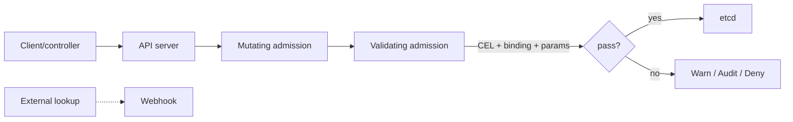

# Kubernetes CEL Admission Policies, Failure Semantics & Policy Rollout

## Neden önemli?
Admission, authenticated/authorized Kubernetes API request'inin persistence öncesindeki policy boundary'sidir. Admission webhook'ları external service call ile güçlü policy sağlar; fakat network, TLS, timeout ve availability failure surface'i ekler.

ValidatingAdmissionPolicy, CEL kurallarını API server içinde değerlendirir ve Kubernetes v1.30'dan beri stable'dır. Policy logic'i, Binding scope/enforcement'ı, optional parameter resource ise environment-specific değerleri taşır. Kubernetes v1.36 ile MutatingAdmissionPolicy stable hale gelerek CEL tabanlı in-process mutation sağlar.

## Mental model

## İçeride ne oluyor?
- Policy match constraints ve CEL validation logic'ini tanımlar.
- Binding policy'yi resource/namespace scope'una bağlar; binding olmadan policy etkili değildir.
- CEL `object`, `oldObject`, `request`, `params`, `namespaceObject` ve authorization helper'larına erişebilir.
- Parameter resource aynı policy'nin farklı namespace/environment limitleriyle kullanılmasını sağlar.
- Multiple matching bindings ilgili evaluations'ın tamamının geçmesini gerektirir.
- `failurePolicy: Fail` evaluation error'da reject; `Ignore` bypass/availability trade-off'u taşır.
- CEL evaluation cost budget control-plane'i pahalı evaluation'dan korur.
- MutatingAdmissionPolicy CEL ile mutation sağlar; external registry/signature/data lookup gibi ihtiyaçlarda webhook gerekebilir.
- Rollout'ta Audit/Warn → telemetry → Deny progression blast radius'u azaltır.

## Mülakat soruları
1. Admission neden authn/authz'dan ayrı bir katmandır?
2. CEL policy ile webhook trade-off'u nedir?
3. Policy/Binding neden ayrıdır?
4. Fail vs Ignore hangi security/availability risklerini taşır?
5. Senior: image-tag policy prod'a nasıl güvenli rollout edilir?
6. Senior: hangi policy webhook gerektirir?
7. Staff: fleet policy versioning, exceptions, audit ve break-glass nasıl tasarlanır?
8. Staff: bootstrap gap ve admission policy'nin kendisinin korunması neden önemlidir?

## Seviye beklentisi
- **Junior:** request lifecycle ve validation/mutation farkını bilir.
- **Mid:** CEL, policy/binding/params ve failurePolicy semantics'ini açıklar.
- **Senior:** webhook-vs-CEL, staged rollout ve false-positive yönetir.
- **Staff:** fleet governance, policy-as-code tests, audit evidence ve control-plane SLO'larını tasarlar.

## Mini alıştırma
`latest` image tag yasağı ve namespace-parametreli replica limiti için policy/binding/param ayrımını çiz. Warn+Audit'ten Deny'a rollout ve Fail/Ignore seçimini gerekçelendir.

## Proje
kind cluster'da owner-label, replica-limit ve forbidden-latest policies yaz. Parametre, Warn/Audit/Deny ve invalid-CEL/failurePolicy senaryolarını test et; webhook varyantıyla latency/failure surface'i karşılaştır.

## Failure modes / trade-off / production
Broad match deploy'ları durdurabilir. Fail policy bug'ını outage'a çevirebilir; Ignore guardrail'i sessizce bypass edebilir. Webhook timeout/cert/DNS problemi admission'ı etkiler. Mutation ownership/debugging karmaşası yaratabilir. Admission p95/p99, deny/warn/audit count, evaluation error, webhook timeout, policy version, exception ve break-glass event'leri izlenmelidir.

## Kaynaklar
- Validating Admission Policy: https://kubernetes.io/docs/reference/access-authn-authz/validating-admission-policy/
- Policies overview: https://kubernetes.io/docs/concepts/policy/
- Mutating Admission Policy: https://kubernetes.io/docs/reference/access-authn-authz/mutating-admission-policy/
- Admission Controllers: https://kubernetes.io/docs/reference/access-authn-authz/admission-controllers/
