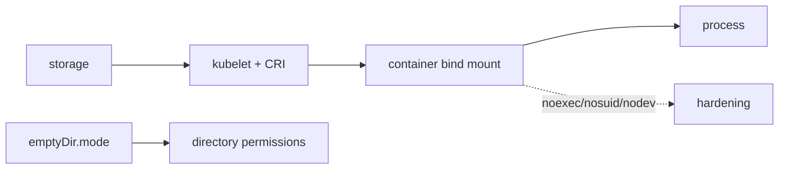

# Kubernetes v1.37 Bind Mount Hardening & `emptyDir` Permissions

## Konu anlatımı
`readOnlyRootFilesystem` writable volumes üzerindeki execution surface'ini kapatmaz. Kubernetes v1.37 iki Alpha primitive ekler: `VolumeBindMountOptions` ile container bind mount'larında `noexec`, `nosuid`, `nodev`; `EmptyDirVolumeMode` ile `emptyDir` Unix permission mode'u (`0000`–`01777`). PV `mountOptions` storage/filesystem katmanındayken `bindMountOptions` container'a görünen bind mount katmanındadır.

## Mental model

**Invariant:** mount flags defense-in-depth'tir; sandbox veya application authorization değildir.

## İçeride ne oluyor?
- `bindMountOptions` container başına uygulanır; izinli Linux flags `noexec`, `nodev`, `nosuid`'dir.
- Runtime CRI `mount_options` desteğini advertise etmelidir; destek yoksa kubelet Pod'u reject eder.
- `emptyDir.mode` default `0777`; `01777` shared `/tmp` için sticky-bit semantics sağlar.
- `fsGroup`, group permissions üzerinde `mode` ile etkileşir/override edebilir.
- Her iki özellik v1.37'de Alpha ve disabled by default'tur; version skew ve feature gates rollout contract'ının parçasıdır.

## Mülakat soruları
1. `readOnlyRootFilesystem` neden writable volume riskini çözmez?
2. `noexec`, `nosuid`, `nodev` neyi azaltır?
3. PV `mountOptions` ile `bindMountOptions` farkı nedir?
4. Senior: unsupported runtime node'da fail-open mı fail-closed mı?
5. Staff: admission policy, exceptions ve staged rollout nasıl tasarlanır?
6. Principal: Alpha security primitive regulated fleet'e hangi kanıtlarla alınır?

## Beklenen cevap derinliği
- **Mid:** Unix permissions, sticky bit ve mount flags.
- **Senior:** CRI capability, fsGroup, version skew, bypass sınırları.
- **Staff:** policy, discovery, staged rollout, exception governance.
- **Principal:** compliance evidence, maturity/risk ve rollback.

## Mini alıştırma
İki container'ın paylaştığı `emptyDir` için `01777` ve `noexec,nosuid` uygula. Cross-user deletion ve direct execution testleri yaz; `fsGroup` eklenince davranışı yeniden doğrula.

## Proje fikri
`volume-hardening-auditor`: writable mounts, missing flags, permissive `emptyDir`, unsupported runtime ve exception TTL'lerini raporlayan audit/admission aracı.

## Failure modes / trade-off / production
`noexec`'i sandbox sanmak, runtime capability kontrol etmeden enforce etmek, `fsGroup` etkisini kaçırmak ve feature gate'i fleet'in yalnız bölümünde açmak tipik hatalardır. Build/ML workloads executable workspace gerektirebilir; policy exception'ları süreli ve gözlenebilir olmalıdır. İzle: rejected Pods, unsupported nodes, exceptions, security-context drift ve workload breakage.

## Kaynaklar
- Kubernetes, 16 Eylül 2026 — https://kubernetes.io/blog/2026/09/16/kubernetes-v1-37-hardening-container-storage/
- https://kubernetes.io/docs/tasks/configure-pod-container/configure-bind-mount-options/
- https://kubernetes.io/docs/tasks/configure-pod-container/configure-emptydir-volume-mode/
- https://kubernetes.io/docs/concepts/storage/volumes/
