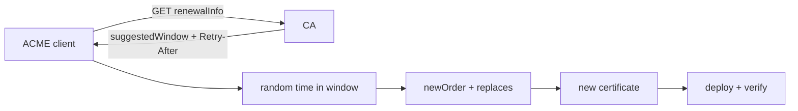

# ACME ARI: Renewal Windows & Certificate Fleet Safety

**Seviye:** Junior → Staff  
**Alan:** Cybersecurity / Cloud / SRE

## Mental model

## Temel fikir
Sabit `expiry - N days` renewal policy büyük certificate fleet'lerinde aynı anda renewal spike üretebilir. RFC 9773 ACME Renewal Information (ARI), CA'nın client'a `suggestedWindow` ile uygun renewal aralığı bildirmesini sağlar. Client window içinde random bir zaman seçerek load'u dağıtabilir; CA da mass-revocation veya incident öncesi renewal'ı erkene çekebilir.

ARI expiration safety'nin yerine geçmez. Client `Retry-After`, bounded retry/backoff, persistent failure state ve fallback renewal schedule tutmalıdır. Yeni ACME order'daki `replaces` alanı predecessor certificate ile replacement'ı ilişkilendirir.

## Interview invariants
- Renewal window bir scheduling hint/protocol signal'dır; expiry deadline değişmez.
- Randomization herd effect'i azaltır.
- Temporary errors bounded exponential backoff ister; ARI unavailable olduğunda fallback gerekir.
- Renewal success ile deployment success farklı state'lerdir.
- Clock skew ve stale scheduling state certificate outage'a dönüşebilir.

## Failure modes ve trade-off
Çok sık ARI polling CA'yı yükler; çok seyrek polling emergency window değişikliklerini geç öğrenir. Invalid window, clock skew, retry storm, CA outage ve yeni certificate'ın deploy edilememesi temel failure mode'lardır.

## Production gözlemleri
`time_to_expiry`, scheduled renewal time, ARI fetch errors/latency, renewal success rate, retry count, deployment verification ve certificate-age histogram birlikte izlenmelidir.

## Kaynaklar
- RFC 9773 — ACME Renewal Information Extension: https://www.rfc-editor.org/rfc/rfc9773.html
- RFC 8555 — ACME: https://www.rfc-editor.org/rfc/rfc8555.html
