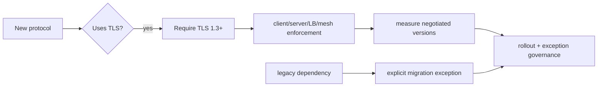

# RFC 9852: TLS 1.3 as the Minimum Baseline for New Protocols

## Problem
TLS version policy yalnız cipher-suite configuration değildir; protocol design contract'ıdır. Temmuz 2026 tarihli RFC 9852, BCP 195'i güncelleyerek TLS kullanan **yeni protokollerin TLS 1.3'ü zorunlu tutmasını** ister. RFC bu zorunluluğu TLS için getirir; DTLS için aynı prescription'ı uygulamaz.

Kritik ayrım `support` ile `require` arasındadır. Bir server TLS 1.3 desteklediği halde minimum-version policy TLS 1.2'ye izin veriyorsa legacy negotiation surface hâlâ production contract'ının parçasıdır.

## Mental model

> Invariant: “TLS 1.3 capable” ile “TLS 1.3 required” aynı security property değildir.

## Neden önemli?
- TLS 1.3 legacy cryptographic surface'i azaltır ve yeni protocol tasarımlarının geçmiş uyumluluk yükünü baştan taşımasını önler.
- Minimum-version contract SDK, server, external load balancer, service mesh ve test matrix boyunca tutarlı enforce edilmelidir.
- TLS sürümü tek başına endpoint security değildir. Certificate validation, hostname/workload identity, key lifecycle ve application authorization ayrı katmanlardır.
- 0-RTT kullanılıyorsa replay riskleri application operation bazında değerlendirilmelidir. TLS 1.3 kullanmak side-effecting operation'ı otomatik replay-safe yapmaz.
- Legacy client/middlebox dependency migration problemidir; yeni protocol standardının baseline'ını sessizce düşürmek yerine inventory, staged rollout ve explicit exception gerekir.
- Post-quantum migration cryptographic agility problemidir. TLS 1.3 baseline yararlı bir temel sağlar fakat belirli bir PQ key exchange deployment'ını tek başına çözmez.

## Mülakat soruları
1. `TLS 1.3 supported` ile `TLS 1.3 required` farkı nedir?
2. Yeni protocol neden legacy TLS compatibility'yi varsayılan taşımamalıdır?
3. TLS 1.3 certificate/hostname validation problemini çözer mi?
4. 0-RTT hangi operation'larda replay riski yaratır?
5. Service mesh + external LB + SDK fleet boyunca minimum TLS version nasıl doğrulanır?
6. Büyük legacy müşteri TLS 1.2'ye bağımlıysa security baseline ve business migration nasıl dengelenir?

## Seviyeye göre beklenen cevap
- **Mid:** TLS'in confidentiality/integrity/peer-authentication rolü ve minimum version.
- **Senior:** downgrade surface, 0-RTT replay, certificate validation ve termination boundaries.
- **Staff:** policy-as-code, inventory, telemetry, staged rollout ve exception expiry.
- **Principal/CTO:** cryptographic agility, compliance, customer migration, risk acceptance ve deprecation governance.

## Mini alıştırma
Yeni internal RPC protocol için profile yaz: minimum TLS version, endpoint identity, certificate validation, 0-RTT policy, config owner, telemetry ve exception TTL. Fleet'in %2'si TLS 1.2 kullanıyorsa migration wave'lerini ve kill criteria'yı tanımla.

## Proje fikri
`tls-baseline-auditor`: endpoint listesini tarayıp negotiated TLS version, certificate expiry/identity ve policy compliance raporu üret. CI'da yeni endpoint'lerin TLS 1.3 minimumunu ihlal etmesini engelle; secret/private-key material toplama.

## Failure modes / production
TLS 1.3'ü destekleyip minimumu enforce etmemek, external LB'de modern TLS varken iç hop'taki legacy TLS'i görmemek, certificate validation'ı kapatmak, 0-RTT replay riskini yok saymak, exception'ları süresiz bırakmak ve PQ migration'ı “TLS 1.3 var” diyerek tamamlanmış saymak tipik hatalardır. Production'da negotiated-version distribution, handshake failures, certificate errors/expiry, exception inventory/age ve deprecated-client population izlenmelidir.

## Kaynaklar
- RFC 9852 / BCP 195 — New Protocols Using TLS Must Require TLS 1.3: https://www.rfc-editor.org/rfc/rfc9852.html
- RFC 8446 — TLS 1.3: https://www.rfc-editor.org/rfc/rfc8446.html
- RFC 9325 / BCP 195 — Recommendations for Secure Use of TLS and DTLS: https://www.rfc-editor.org/rfc/rfc9325.html
