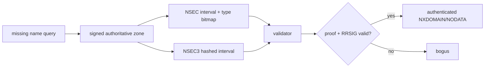

# DNSSEC NSEC/NSEC3 & Authenticated Denial of Existence

**Seviye:** Mid → Principal

## Konu anlatımı
DNSSEC yalnız var olan RRset'lerin authenticity/integrity'sini değil, bir name veya RR type'ın gerçekten bulunmadığı iddiasını da doğrulamalıdır. Aksi halde saldırgan signed positive answer'ı bastırıp sahte NXDOMAIN üretebilir. Bu problem **authenticated denial of existence** ile çözülür.

NSEC, canonical name order'da sonraki owner name'i ve mevcut RR type bitmap'ini signed record olarak taşır; böylece bir name interval'ın boş olduğu veya mevcut name'de belirli type'ın bulunmadığı kanıtlanır. NSEC zinciri zone enumeration'ı kolaylaştırabilir. NSEC3 owner name'leri hash-space'e taşır ve Opt-Out desteği ekler; enumeration'ı zorlaştırır fakat hashing confidentiality değildir ve validation complexity getirir. Wildcard durumlarında closest-encloser/next-closer reasoning önemlidir.

RFC 9824 (Eylül 2025), online signing senaryoları için Compact Denial of Existence yaklaşımını standartlaştırır; minimally-covering NSEC/NSEC3 ile negative response ve online signing işini azaltmayı hedefler.

## Mental model
DNSSEC'te **yokluk da kanıt ister**. NSEC name-space interval'ını, NSEC3 hash-space interval'ını signed biçimde kanıtlar.

## İçeride ne oluyor?
1. Validator DNSKEY/DS chain-of-trust bağlamını kurar.
2. Positive RRset yoksa authoritative server denial records döndürür.
3. NSEC name interval/type bitmap ile nonexistence kanıtlar.
4. NSEC3 aynı modeli hashed owner-name space'e taşır.
5. Wildcard ihtimali de proof içinde dışlanmalıdır.
6. Validator denial record'un RRSIG ve coverage bilgisini doğrular.
7. Secure zone'da geçersiz proof sıradan NXDOMAIN değil `bogus` validation failure'dır.

## Mülakat soruları
- DNSSEC neden negative answers'ı authenticate eder?
- NSEC name ve type nonexistence'i nasıl kanıtlar?
- NSEC zone enumeration trade-off'u nedir; NSEC3 neyi değiştirir?
- NSEC3 hashing neden confidentiality değildir?
- Wildcard varken NXDOMAIN proof neden karmaşıklaşır?
- Validation failure ile normal NXDOMAIN telemetry'si neden ayrılmalıdır?

## Beklenen cevap seviyesi
- **Mid:** signed denial proof, interval ve type bitmap.
- **Senior:** NSEC3, Opt-Out, wildcard/closest-encloser ve enumeration trade-off.
- **Staff:** validator behavior, caching, rollover ve observability.
- **Principal:** provider/resolver interoperability, key lifecycle, staged rollout ve availability/security policy.

## Mini alıştırma
Zone'da `a.example` ve `d.example` varken `b.example` yok. NSEC interval proof'unu çiz. Ardından mevcut bir name'de eksik `AAAA` için type bitmap rolünü ve wildcard eklendiğinde gereken ek reasoning'i açıkla.

## Proje fikri
**dnssec-denial-lab:** disposable signed zone'da NSEC/NSEC3 ile `dig +dnssec` NXDOMAIN/NODATA cevaplarını karşılaştır; test fixture'da broken/expired signature ile validating resolver'ın bogus davranışını gözle.

## Failure modes / trade-off / production
Expired signatures, broken trust chain, yanlış NSEC3/Opt-Out ve wildcard proof hataları resolution outage yaratabilir. NSEC enumeration kolaylığı; NSEC3 ise complexity/CPU getirir. DNSSEC confidentiality veya DoS koruması değildir. SERVFAIL/bogus rate, rollover state, signature expiry horizon, negative-answer rate, response size ve authoritative QPS izlenmelidir.

## Kaynaklar
- RFC 4033: https://www.rfc-editor.org/rfc/rfc4033.html
- RFC 5155 — NSEC3: https://www.rfc-editor.org/rfc/rfc5155.html
- RFC 7129 — Authenticated Denial: https://www.rfc-editor.org/rfc/rfc7129.html
- RFC 9276 — NSEC3 Parameter Guidance: https://www.rfc-editor.org/rfc/rfc9276.html
- RFC 9824 — Compact Denial of Existence (September 2025): https://www.rfc-editor.org/rfc/rfc9824.html
