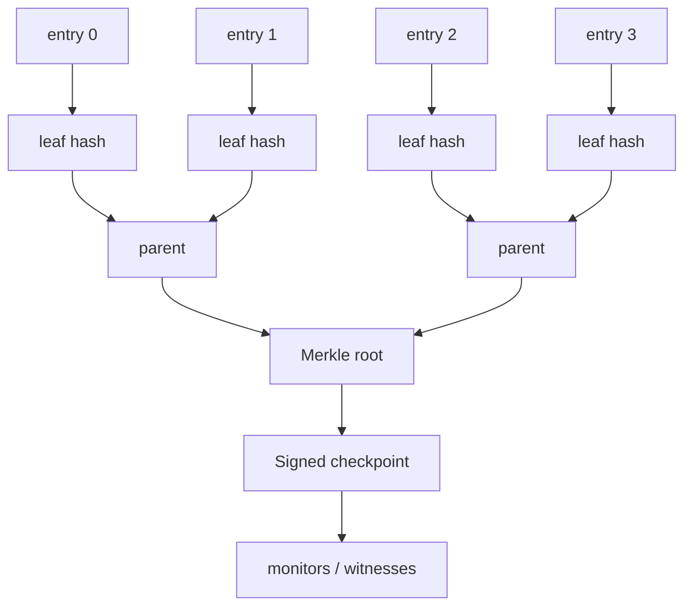

# Transparency Logs, Merkle Inclusion & Consistency Proofs

**Seviye:** Mid → Principal  
**Alan:** Cybersecurity + Distributed Systems

## Konu anlatımı
Transparency log, geçmişi sessizce yeniden yazmayı kriptografik olarak fark edilebilir yapan append-only bir log yapısıdır. Ordered entry'ler Merkle tree leaf'lerine bağlanır; belirli tree size için root/checkpoint imzalanır.

**Inclusion proof**, bir leaf'in belirli root/tree size altında bulunduğunu O(log n) sibling hash ile kanıtlar. **Consistency proof** ise eski tree'nin yeni tree'nin değişmemiş prefix'i olduğunu doğrular. Birincisi “entry var mı?”, ikincisi “history append-only büyüdü mü?” sorusunu cevaplar.

İmzalı checkpoint tek başına global tek görünüm garantisi vermez. Kötü niyetli log farklı istemcilere farklı ama ayrı ayrı valid görünümler sunabilir; monitor, witness ve checkpoint paylaşımı split-view/equivocation riskini azaltır.

## Mental model

## İçeride ne oluyor?
1. Entry deterministic leaf hash'e çevrilir.
2. Parent hash child hash'lerden türetilir; root ordered prefix'e commitment olur.
3. Log tree size + root içeren checkpoint'i imzalar.
4. Inclusion verifier sibling path ile root'u yeniden hesaplar.
5. Consistency verifier old/new checkpoint'in append-only ilişkisini doğrular.
6. Monitor entry'leri inceler; witness'lar checkpoint'leri bağımsız gözlemler.

## Mülakat soruları
- Inclusion proof ile consistency proof farkı nedir?
- Proof boyutu neden yaklaşık O(log n)'dir?
- Signed checkpoint neyi kanıtlar, neyi kanıtlamaz?
- Malicious log iki kullanıcıya farklı valid root gösterirse ne olur?
- Staff/Principal: witness/gossip topolojisini hangi trust ve availability trade-off'larıyla tasarlarsın?

## Beklenen cevap seviyesi
- **Mid:** Merkle tree/root/inclusion ve append-only fikrini ayırır.
- **Senior:** checkpoint, consistency proof ve split-view riskini açıklar.
- **Staff:** proof serving, sharding, monitor lag ve operasyonel failure mode'ları tartışır.
- **Principal:** independent witness, trust-domain ve incident evidence governance bağlantısını kurar.

## Mini alıştırma
8 leaf'li Merkle tree çiz; leaf 3 inclusion proof'unda gereken sibling hash'leri işaretle. Ardından yalnız `root8` ve `root12` değerlerine bakmanın append-only geçmişi neden kanıtlamadığını açıkla.

## Proje fikri
`transparency-log-lab`: append sonrası Merkle root üreten, inclusion proof doğrulayan ve conflicting checkpoint'i yakalayan küçük witness içeren bir log geliştir.

## Failure modes / trade-off / production
İmzalı root'u global truth sanmak; inclusion/consistency'yi karıştırmak; monitor çalışmıyorken güven varsaymak tipik hatalardır. Production'da checkpoint age, inclusion latency/error, consistency failure, monitor lag, conflicting checkpoint ve signer/witness health izlenir.

## Kaynaklar
- RFC 9162 — Certificate Transparency v2: https://www.rfc-editor.org/rfc/rfc9162.html
- Sigstore Rekor overview: https://docs.sigstore.dev/logging/overview/
- Sigstore Rekor security: https://docs.sigstore.dev/about/security/
- Sigstore Rekor sharding: https://docs.sigstore.dev/logging/sharding/
