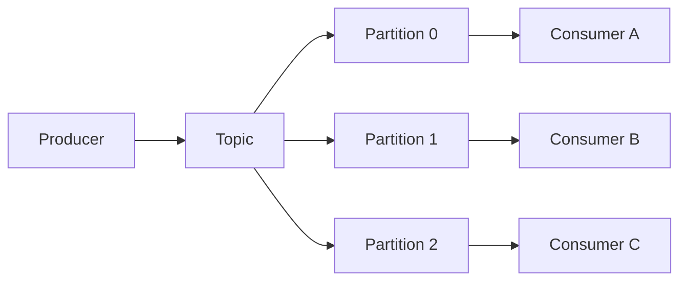

# Kafka: Partitions, Consumer Groups ve Ordering

Kafka'da topic'ler partition'lara bölünür. Partition hem ölçeklenme hem de ordering sınırıdır.

## Temel noktalar

- Aynı consumer group içindeki bir partition aynı anda tek consumer tarafından işlenir.
- Daha fazla partition paralellik sağlar.
- Ordering partition içindedir; global ordering farklı ve daha pahalı bir problemdir.
- Partition key yanlış seçilirse hot partition oluşabilir.
- Consumer lag, producer ile consumer ilerlemesi arasındaki farkı gösterir.

## Mülakat soruları

1. Topic, partition ve consumer group nedir?
2. Partition sayısı neyi etkiler?
3. Ordering nerede korunur?
4. Consumer lag neden büyür?
5. Rebalance nedir?
6. Duplicate processing nasıl yönetilir?
7. Partition key nasıl seçilir?

## Lab

Bir `orders` topic'i kur. `customer_id` ile partition et. İki consumer çalıştır; birini yavaşlat ve lag gözlemle. Aynı event'i iki kez üretip idempotent consumer davranışı ekle.

## Habitat bağlantısı

Online storage değişiklikleri CDC ile Kafka benzeri bir stream'e aktarılabilir. Partition key; tenant, entity veya ordering ihtiyacına göre seçilir. Kritik karar: streaming katmanı online write path'in zorunlu parçası mı, yoksa asenkron downstream mi?

## Ana kaynaklar

- Apache Kafka Documentation: https://kafka.apache.org/documentation/
- Kafka Design: https://kafka.apache.org/documentation/#design
- Consumer Configs: https://kafka.apache.org/documentation/#consumerconfigs
