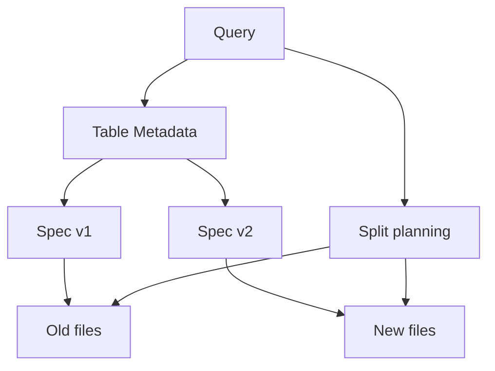

# Apache Iceberg: Schema ve Partition Evolution

Iceberg partition bilgisini table metadata'sında tutarak hidden partitioning sağlar. Partition spec değiştiğinde eski data files eski spec ile kalabilir, yeni files yeni spec ile yazılabilir; planner her layout için filter/pruning uygular. Böylece partition evolution zorunlu eager full rewrite gerektirmez.

Schema evolution'da unique field ID kullanımı rename/drop gibi değişikliklerde kolon anlamını isim veya pozisyona bağımlı olmaktan çıkarır.

## Production trade-off'ları
Evolution, fiziksel bakım ihtiyacını ortadan kaldırmaz: small files, metadata büyümesi, snapshot lifecycle, compaction ve eski engine compatibility hâlâ yönetilmelidir. Habitat-benzeri object-storage abstraction'larında metadata/catalog katmanının fiziksel layout'u tüketiciden saklamasına iyi bir örnektir.

## Kaynaklar
- https://iceberg.apache.org/docs/latest/evolution/
- https://iceberg.apache.org/spec/
