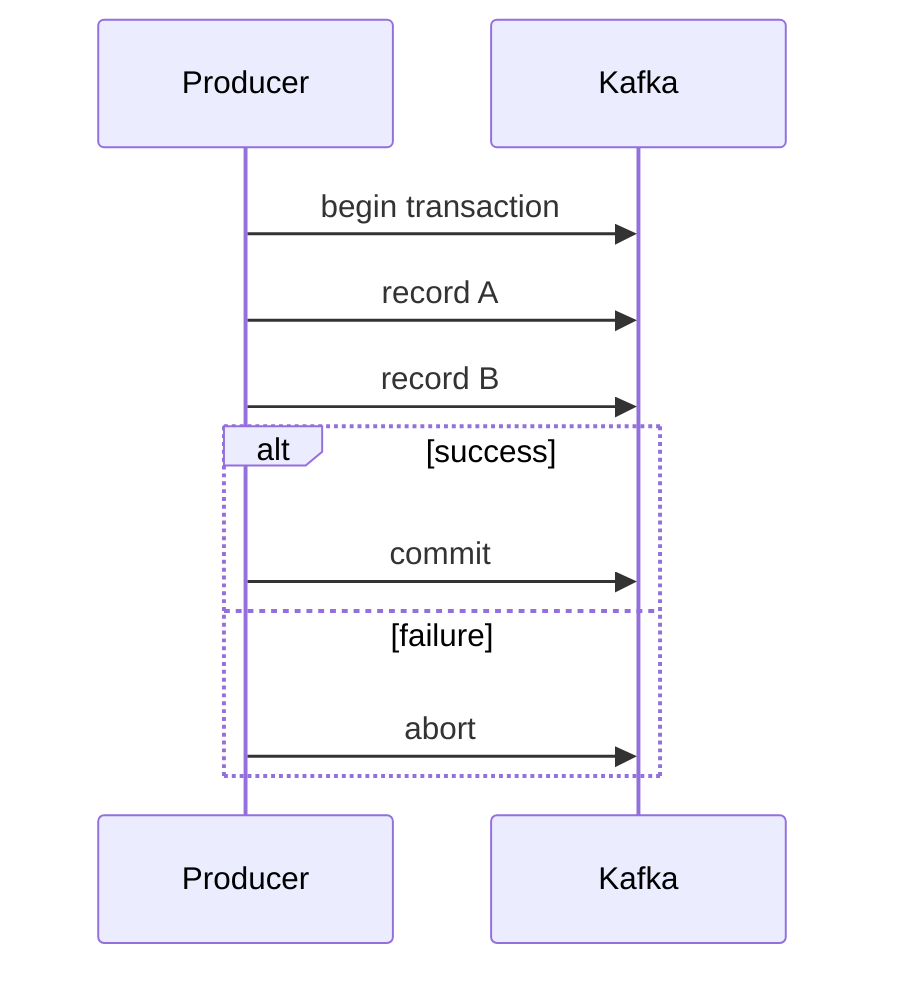

# Kafka Idempotent Producer ve Transactions

## Problem
Network timeout sonrası producer, broker'ın ilk yazımı kabul edip etmediğini bilemeyebilir. Retry güvenilirliği artırırken duplicate riski yaratır. Kafka idempotent producer, desteklenen producer/partition semantics içinde retry kaynaklı duplicate yazımları önlemeye yardım eder.

`transactional.id` ile producer transaction kullanabilir ve idempotence de etkinleşir. Transaction birden fazla Kafka write'ını atomik commit/abort sınırına alabilir. Consumer tarafında committed transactional veriyi okumaya uygun isolation seçimi gerekir.

## Exactly-once sınırı
Kafka transaction, harici ödeme API'si, e-posta veya ayrı bir database side-effect'ini otomatik olarak aynı atomik sınırın içine almaz. End-to-end correctness için idempotency key, transactional outbox/inbox, replay-safe consumer gibi desenler gerekebilir.

## Mülakat soruları
- At-least-once neden duplicate üretebilir?
- Idempotence ile transaction farkı nedir?
- `transactional.id` ne sağlar?
- `read_committed` consumer neyi filtreler?
- External side-effect için neden ek tasarım gerekir?

## Failure modes
Uzun transaction, yanlış isolation, replay-safe olmayan consumer, external side-effect'i Kafka transaction kapsamındaymış gibi varsaymak ve "exactly once" ifadesini sistem geneline genellemek.

## Habitat bağlantısı
Adapter sonucu ve audit event aynı Kafka transaction'ında olabilir; ancak gerçek storage backend'e yapılan write ayrı bir atomik domain ise reconciliation/idempotency gerekir.

## Kaynaklar
- https://kafka.apache.org/40/configuration/producer-configs/
- https://kafka.apache.org/documentation/#design
