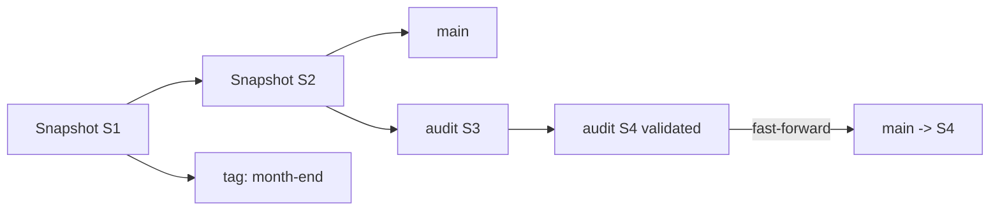

# Apache Iceberg Snapshot Retention, Branches, WAP & Safe Maintenance

## Konu anlatımı
Iceberg her write'ta yeni immutable snapshot üretir. Snapshot'lar reader isolation, time travel ve rollback sağlar; retention sınırsızsa metadata/storage büyür. `expire_snapshots`, retention dışındaki eski snapshot'ları metadata'dan çıkarır ve artık geçerli snapshot'larca referans edilmeyen dosyaların temizlenmesini sağlar.

Branches ve tags snapshot'lara named reference ve bağımsız lifecycle verir. Branch mutable bir head ve bağımsız snapshot lineage'ıdır; tag tarihsel snapshot'ı sabitlemek/audit retention için uygundur. Bu yüzden audit tag'i eski snapshot'ı koruyabilir. Branch/tag semantiği full table copy değildir: metadata reference ve snapshot graph üzerinden çalışır.

## Write-Audit-Publish (WAP)
Production `main`'e doğrudan görünür write yapmak yerine audit branch'e yazılabilir. Data-quality ve business invariant testleri geçtikten sonra `main`, audit branch head'ine fast-forward edilir. Fast-forward için target branch'in source lineage'ın ancestor'ı olması gerekir; araya concurrent main commit girdiyse publish workflow conflict'i açıkça ele almalıdır.

**Invariant:** publish yalnız doğrulanmış lineage'ı production head'e taşır; retention policy ise hangi tarihsel snapshot'ların yaşamaya devam edeceğini belirler.

## İçeride ne oluyor?
- Snapshot log, manifests ve data/delete-file referansları table state'i oluşturur.
- Branch mutable named ref; tag tarihsel snapshot ref'idir.
- Branch/tag kendi reference ve snapshot retention policy'lerine sahip olabilir.
- `delete orphan files` farklıdır: metadata graph'ında hiç referans edilmeyen, örneğin failed write'tan kalmış dosyaları age guard ile temizler.
- Streaming commit'leri snapshot/manifest/small-file sayısını hızlı büyütebilir; commit cadence ve maintenance gerekir.
- Snapshot expiration, old metadata cleanup, data-file compaction ve manifest rewrite ayrı maintenance operasyonlarıdır.
- Iceberg REST Catalog server-side planning ve freshness-aware metadata caching gibi control-plane optimizasyonları sunabilir; catalog availability ve latency production SLO'nun parçasıdır.

## Mülakat soruları
1. Snapshot, branch ve tag arasındaki fark nedir?
2. WAP neden staging table copy'den daha güçlü olabilir?
3. Fast-forward hangi koşulda güvenlidir?
4. Snapshot expiration ile orphan deletion farkı nedir?
5. Tag neden snapshot expiration'ı engeller?
6. Branch query ile tag query schema semantics neden farklı olabilir?
7. Senior: streaming table neden daha sık maintenance ister?
8. Staff/Principal: concurrent writer, validation failure, publish race ve catalog failure'ını nasıl tasarlarsın?

## Beklenen cevap seviyesi
- **Mid:** snapshot/time travel, branch/tag ve retention.
- **Senior:** WAP, refs, orphan safety, streaming metadata ve commit conflict.
- **Staff:** publish workflow, fleet maintenance scheduler, catalog/object-store load ve observability.
- **Principal/CTO:** audit/compliance retention, multi-engine contract ve storage/control-plane maliyeti.

## Mini alıştırma
`orders` tablosunda main S20'deyken audit branch oluştur; ETL S21/S22 üretsin. Row-count, null-rate ve revenue invariant'ları geçerse main'i fast-forward et. Month-end tag'i 180 gün, audit branch'i 7 gün tut. Concurrent main commit gelirse publish'in neden durması gerektiğini açıkla.

## Proje fikri
`iceberg-wap-maintenance-lab`: branch write, validation, fast-forward publish, historical tag, dry-run expiration ve protected-ref raporu. Validation fail, concurrent main commit ve stale branch fault injection ekle.

## Failure modes / trade-off / production bağlantısı
Branch'i table copy sanmak, tag'i sonsuza kadar tutup storage growth'u unutmak, validation-publish race'ini yok saymak, orphan cutoff'u agresif seçmek, streaming commit cadence'i aşırı küçültmek ve catalog'u kritik control-plane olarak izlememek tipik hatalardır. Snapshot count/age, refs by age, metadata/storage bytes, commit latency/conflict rate, validation/publish latency, manifest/file count ve catalog load latency izlenmelidir.

## Kaynaklar
- Apache Iceberg — Branching and Tagging: https://iceberg.apache.org/docs/latest/branching/
- Apache Iceberg — Spark Queries: https://iceberg.apache.org/docs/latest/spark-queries/
- Apache Iceberg — Maintenance: https://iceberg.apache.org/docs/latest/maintenance/
- Apache Iceberg 1.11.0 release — 19 Mayıs 2026: https://iceberg.apache.org/blog/apache-iceberg-1.11.0-release/
- Apache Iceberg — REST Catalog Protocol: https://iceberg.apache.org/docs/nightly/rest-protocol/
- Apache Iceberg — Structured Streaming: https://iceberg.apache.org/docs/1.10.0/spark-structured-streaming/
