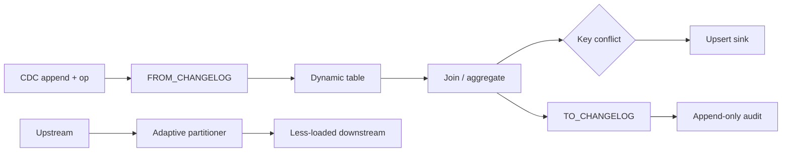

# Flink Changelog Conversion, Conflict Semantics & Backpressure-Aware Partitioning

## Neden önemli?
Streaming SQL'de dynamic table, `INSERT`, `UPDATE_BEFORE`, `UPDATE_AFTER` ve `DELETE` değişiklikleriyle evrilir. CDC kaynakları ve append-only sink'ler ise çoğu zaman bu semantiği düz event satırlarıyla taşır. Flink 2.3 `FROM_CHANGELOG` ve `TO_CHANGELOG` Process Table Function'larıyla bu iki representation arasında SQL seviyesinde explicit dönüşüm sağlar.

## Mental model

**Invariant:** representation değişebilir; update/delete semantiği kaybolursa sonuç tablosu aynı değildir.

## Changelog conversion
`FROM_CHANGELOG`, explicit operation column taşıyan append-only input'u updating dynamic table'a dönüştürür. Operation column engine tarafından yorumlanıp output'tan çıkarılır. Bilinmeyen veya null operation runtime failure yaratabilir. Flink 2.3 temel kullanımında full update image önemlidir; `UPDATE_BEFORE`/`UPDATE_AFTER` eksikliği aggregation ve join correctness'ini bozabilir.

`TO_CHANGELOG` ters yönde dynamic-table change kind'larını explicit operation column taşıyan INSERT-only satırlara dönüştürür. Audit, archival ve append-only sink için değerlidir. `op_mapping` bazı operation'ları filtreleyebilir; bu nedenle mapping yalnız encoding değil data semantics contract'ıdır.

## Sink conflict semantics
Flink 2.3, query upsert key ile sink primary key farklı olduğunda davranışı `ON CONFLICT` ile explicit hale getirir:
- `DO ERROR`: mismatch'i fail-fast yapar.
- `DO NOTHING`: conflict'i düşürür; veri kaybı semantiği bilinçli olmalıdır.
- `DO DEDUPLICATE`: state kullanarak materialize/deduplicate eder; correctness karşılığında state ve checkpoint maliyeti getirir.

## Backpressure-aware partitioning
Round-robin routing bir downstream subtask yavaşladığında onu beslemeye devam ederek backpressure yaratabilir. Flink 2.3 adaptive partition selection opt-in biçimde downstream channel load'una göre daha boş adayları seçebilir. Bu optimizasyon key-based partitioning gibi correctness invariant'larının yerine geçmez.

## Mülakat soruları
1. Dynamic table ile append-only stream farkı nedir?
2. `UPDATE_BEFORE` neden gereklidir?
3. `TO_CHANGELOG` neden yalnız serialization değildir?
4. Upsert key ile sink primary key mismatch'i ne doğurur?
5. `DO ERROR` ve `DO DEDUPLICATE` ne zaman seçilir?
6. Senior: before-image olmayan CDC kaynağını nasıl güvenli bağlarsın?
7. Staff: adaptive routing, watermark ve state growth nasıl birlikte düşünülür?
8. Principal: changelog/schema/replay contract'ını platform standardına nasıl dönüştürürsün?

## Seviye beklentisi
- **Mid:** append/upsert/retract ve change kind'ları ayırır.
- **Senior:** before-image, sink key, dedup/replay ve late-data failure mode'larını yönetir.
- **Staff:** partitioning, backpressure, watermark, checkpoint ve exactly-once sink contract'ını birlikte tasarlar.
- **Principal:** CDC semantic contract, schema evolution ve migration guardrail'lerini standardize eder.

## Mini alıştırma
`orders(id,status,total)` için `c/ub/ua/d` event'lerini `FROM_CHANGELOG` ile dönüştür. Status-count aggregation'da `ub` eksikliğinin yanlış sonucu nasıl ürettiğini göster. Sonra audit sink için `TO_CHANGELOG` mapping'i tasarla.

## Proje
`flink-changelog-contract-lab`: sentetik CDC -> changelog conversion -> aggregation -> upsert sink + append-only audit branch. Missing-before, duplicate, key conflict ve slow-downstream fault injection ekle. Correctness diff, state bytes, backpressure, checkpoint duration ve lag ölç.

## Failure modes / production
Before-image yokken full changelog varsaymak, DELETE'i yanlış filtrelemek, conflict'i sessiz dedup'a bırakmak, adaptive partitioning'i key correctness yerine koymak ve throughput'u state/checkpoint maliyetinden bağımsız optimize etmek tipik hatalardır. `invalid op`, conflict, dedup state, backpressure, watermark lag, checkpoint ve sink reconciliation drift izlenir.

## Kaynaklar
- Apache Flink 2.3 — Changelog Conversion: https://nightlies.apache.org/flink/flink-docs-release-2.3/docs/sql/reference/queries/changelog/
- Apache Flink 2.3.0 Release Announcement, 25 Haziran 2026: https://flink.apache.org/2026/06/25/apache-flink-2.3.0-release-announcement/
- Apache Flink 2.3 Release Notes — FLIP-564/558/339: https://nightlies.apache.org/flink/flink-docs-master/release-notes/flink-2.3/
