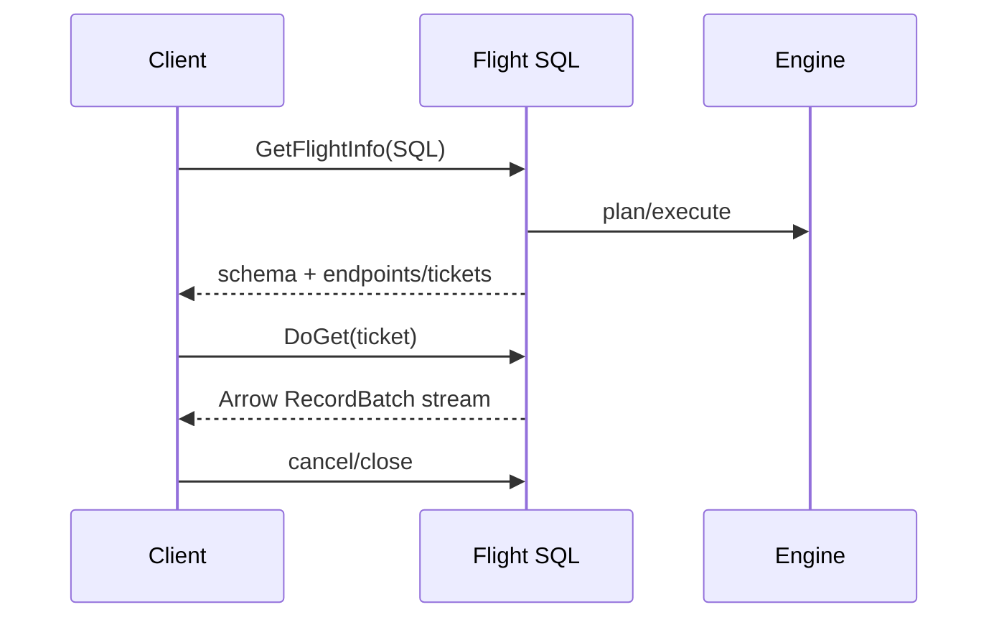

# Apache Arrow Flight SQL: Columnar RPC & Query Transport Economics

## Konu anlatımı
Apache Arrow Flight SQL, SQL database erişimini Arrow columnar in-memory formatı ile Flight RPC framework'ü üzerinde standardize eder. Analytics pipeline'ında zaten columnar olan veriyi row objects/JSON gibi ara temsillere dönüştürmeden RecordBatch streams olarak taşımak serialization, allocation ve CPU maliyetini azaltabilir.

Flight SQL; `GetFlightInfo`, `DoGet`, `DoPut`, `DoAction` gibi Flight primitive'lerini SQL command'larıyla eşler. Client query için schema ve endpoint/ticket bilgisi alıp sonuç partitions'ını stream edebilir. Prepared statements, metadata, transactions ve cancellation gibi driver ihtiyaçları da modellenir. Columnar transport küçük OLTP query'lerinde otomatik üstün değildir; setup/RPC overhead baskın olabilir.

## Mental model

**Invariant:** throughput batching + flow control + execution engine uyumundan gelir; columnar wire format tek başına performans garantisi değildir.

## İçeride ne oluyor?
- SQL protobuf commands descriptor/ticket mekanizmasına bağlanır.
- Arrow schema column types/metadata contract'ını taşır.
- RecordBatch contiguous column buffers ile vectorized consumers'a uygundur.
- Endpoint/ticket ayrımı distributed/parallel result serving sağlayabilir.
- `DoPut` parameter/ingest gibi client-to-server streams için kullanılabilir.
- Cancellation ve transaction lifecycle correctness'in parçasıdır.

## Mülakat soruları
1. Row-oriented ve columnar RPC farkı nedir?
2. Flight ile Flight SQL farkı nedir?
3. FlightInfo/endpoint/ticket ne işe yarar?
4. Columnar transport analytical scan'de neden avantajlıdır?
5. Batch size trade-off'u nedir?
6. Senior: slow consumer backpressure/memory budget nasıl yönetilir?
7. Staff: JDBC/ODBC, REST/JSON, Flight SQL seçimi nasıl yapılır?
8. Principal: multi-tenant endpoint locality, auth, admission ve cost attribution nasıl tasarlanır?

## Beklenen cevap seviyesi
- **Mid:** representation ve RPC lifecycle'ı açıklar.
- **Senior:** batching, flow control, cancellation, memory ownership, TLS/auth trade-off'larını kurar.
- **Staff:** query engine, endpoints, interoperability ve operational compatibility'yi değerlendirir.
- **Principal:** platform standardı, isolation, cost, protocol evolution ve migration stratejisi tasarlar.

## Mini alıştırma
100 kolon/10M satır sonucun yalnız 8 kolonu tüketiliyorsa row JSON, row binary ve Arrow RecordBatch yollarında serialization/allocation/network maliyetlerini çiz; 1 MiB ve 16 MiB batch'i kıyasla.

## Proje fikri
`flight-sql-benchmark`: aynı analytical result'ı REST/JSON ve Flight SQL ile taşı; server CPU, bytes, client allocations, first-batch latency, throughput ve peak RSS ölç. Slow-consumer modu ekle.

## Failure modes / trade-off / production
Columnar formatı otomatik zero-copy sanmak, unbounded buffering, cancellation'ı engine'e propagate etmemek, endpoint locality'yi yok saymak, schema evolution'ı test etmemek ve small-query latency'yi throughput benchmark'ıyla gizlemek tipik hatalardır. First-batch latency, rows/bytes per batch, throughput, RSS, cancellation latency, RPC errors, endpoint skew ve per-tenant query CPU/bytes izle.

## Kaynaklar
- Apache Arrow — Flight SQL: https://arrow.apache.org/docs/format/FlightSql.html
- Apache Arrow — Flight RPC: https://arrow.apache.org/docs/format/Flight.html
- Apache Arrow — Columnar Format: https://arrow.apache.org/docs/format/Columnar.html
