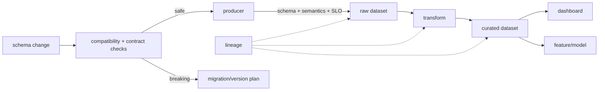

# Data Contracts, Schema Evolution & Lineage

## Neden önemli?
Bir pipeline'ın `SUCCESS` olması verinin doğru veya consumer'larla uyumlu olduğu anlamına gelmez. Producer ile consumer arasında schema, semantics, freshness, ownership ve compatibility beklentileri vardır. Data contract bunları explicit hale getirir; schema evolution değişimin migration kurallarını belirler; lineage output'un hangi dataset/job/field'lardan türediğini gösterir.

## Mental model

## Contract, schema ve lineage ayrımı
Schema teknik shape'i tanımlar. Contract bunun yanında field semantics, nullability, allowed values, ownership, freshness/volume expectation ve compatibility policy içerebilir. Lineage dependency graph'ini verir; veri değerlerinin doğru olduğunu tek başına kanıtlamaz.

## Schema evolution
- Additive change çoğu zaman daha güvenlidir ama strict deserializer, positional mapping veya `SELECT *` consumer yine kırılabilir.
- Rename/drop/type narrowing migration gerektirir.
- Expand → migrate → contract paterni eski ve yeni consumer'ların kontrollü geçişini sağlar.
- Apache Iceberg unique field ID kullanır; add/drop/rename/update/reorder metadata değişiklikleri data-file rewrite gerektirmeden yapılabilir.

## Lineage internals
Dataset/job/run graph'i entity-level dependency'yi; field lineage daha ince impact analysis'i temsil eder. OpenLineage metadata'yı Run, Job ve Dataset entity'lerine facet'lerle bağlar. Explicit lineage facet'leri event boundary'sinden yanlış Cartesian-product dependency çıkarılmasını önleyebilir.

## Mülakat soruları
1. Schema ile data contract farkı nedir?
2. Additive schema change her zaman backward-compatible mıdır?
3. Rename/drop migration'ını nasıl tasarlarsın?
4. Dataset lineage ile field-level lineage ne zaman gerekir?
5. Senior: producer deploy'u downstream dashboard'u sessizce bozuyorsa nasıl önlersin?
6. Staff: yüzlerce pipeline'da contract enforcement'i nasıl platformlaştırırsın?
7. Principal: lineage coverage eksikliğinin governance ve incident etkisi nedir?

## Beklenen cevap seviyesi
- **Mid:** compatibility, producer/consumer ve lineage graph.
- **Senior:** migration, runtime quality, replay/backfill, ownership.
- **Staff:** CI enforcement, catalog/lineage platformu, blast-radius analysis, developer UX.
- **Principal:** organization-wide policy, governance, compliance ve change economics.

## Mini alıştırma
`orders(order_id, user_id, total_cents)` tablosunda `user_id` → `customer_id` rename ve `total_cents` → decimal currency dönüşümü için expand/migrate/contract planı yaz; eski/yeni consumer'ların birlikte çalıştığı evreleri ve lineage edge'lerini çiz.

## Proje fikri
`data-contract-lab`: producer → transform → analytics pipeline kur. Contract CI check, freshness/null runtime checks ve OpenLineage-compatible event üretimi ekle. Breaking rename'i CI'da durdur; migration sonrası impact graph ile etkilenen consumer'ları raporla.

## Failure modes ve production bağlantısı
Schema registry'yi tam contract sanmak, additive değişikliği koşulsuz güvenli kabul etmek, lineage'ı yalnız görsel catalog özelliği olarak toplamak, owner/freshness tanımlamamak ve enforcement'i bypass edilebilir yapmak tipik hatalardır. Contract violations, freshness lag, anomalies, lineage coverage, failed consumers, backfill cost ve mean-time-to-impact-analysis birlikte izlenir.

## Kaynaklar
- OpenLineage core model/specification: https://openlineage.io/docs/
- OpenLineage Lineage Dataset Facet: https://openlineage.io/docs/spec/facets/dataset-facets/lineage/
- OpenLineage Lineage Job Facet: https://openlineage.io/docs/spec/facets/job-facets/lineage/
- Apache Iceberg evolution: https://iceberg.apache.org/docs/latest/evolution/
