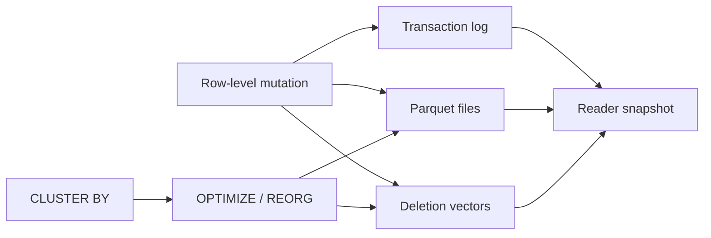

# Delta Lake Deletion Vectors, Liquid Clustering & Table-Feature Economics

**Seviye:** Mid → Principal  
**Alan:** Data Engineering / Databases

## Konu anlatımı
Immutable Parquet dosyalarında küçük bir row-level değişiklik büyük file rewrite üretebilir. Delta Lake deletion vectors (DV), bazı DELETE/UPDATE/MERGE işlemlerinde silinen satırları ayrı removal metadata'sıyla işaretleyerek bu write amplification'ı erteler. Reader transaction log'dan geçerli snapshot'ı çözer ve data file ile DV'yi birlikte uygular. Physical purge daha sonra rewrite ve VACUUM yaşam döngüsüne girer.

Liquid clustering statik partition/ZORDER kararlarını daha esnek bir data-layout modeline taşır. Clustering kolonları değiştirilebilir; sonraki OPTIMIZE işlemleri layout'u incremental dönüştürür. Delta 3.3+ `OPTIMIZE FULL` tüm kayıtları güncel clustering kolonlarına göre yeniden düzenlemek için kullanılabilir.

## Mental model

**Invariant:** Logical correctness transaction-log snapshot'ından gelir; clustering/file layout yalnız bu state'e erişim maliyetini optimize eder.

## İçeride ne oluyor?
- DV açıkken bazı row-level mutations bütün dosyayı hemen rewrite etmek zorunda kalmaz.
- `REORG TABLE ... APPLY (PURGE)` soft-deleted rows içeren dosyaları rewrite eder; eski dosyaların fiziksel temizliği retention sonrası VACUUM'a bağlıdır.
- DV ve clustering table feature/protocol compatibility taşır; client fleet upgrade planı gerekir.
- Liquid clustering Delta Lake 3.1+ özelliğidir ve partitioning/ZORDER ile birlikte kullanılmaz.
- Clustering key değişikliği geçmiş veriyi otomatik rewrite etmez; incremental maintenance ile full recluster arasında compute-cost trade-off'u vardır.

## Mülakat soruları
1. Immutable columnar file üzerinde row delete neden pahalıdır?
2. DV write amplification'ı nasıl düşürür; hangi read cost'u ekler?
3. Logical delete, purge ve VACUUM nasıl ayrılır?
4. Partitioning ile liquid clustering hangi workload'larda ayrışır?
5. Senior: DV yoğunluğu ve file fragmentation nasıl izlenir?
6. Staff: petabyte tabloda clustering-key migration nasıl yapılır?
7. Principal: heterogeneous reader/writer filosunda table-feature upgrade nasıl governance edilir?

## Seviyeye göre cevap derinliği
- **Mid:** log, immutable file, DV ve compaction ilişkisini açıklar.
- **Senior:** read/write amplification, file sizing, retention ve pruning'i ölçer.
- **Staff:** engine compatibility ve maintenance scheduling tasarlar.
- **Principal:** protocol upgrade/rollback sınırlarını platform ekonomisiyle birlikte yönetir.

## Kısa alıştırma
10 TB tabloda günlük %3 row delete ve `tenant_id,event_time` ağırlıklı filtreler için DV açık/kapalı iki tasarım çıkar. Rewrite bytes, scan bytes, purge latency ve client compatibility metriklerini karşılaştır.

## Proje fikri
`delta-layout-lab`: skew'lu sentetik tabloda DV açık/kapalı DELETE/MERGE benchmark'ı yap; commit time, rewritten bytes, file count ve scan latency ölç. Clustering key değiştirip incremental OPTIMIZE ile full reclustering'i karşılaştır.

## Failure modes / trade-off / production
DV'yi bedava delete sanmak, purge/VACUUM'u unutmak, client compatibility envanteri çıkarmamak, sürekli full recluster yapmak ve küçük dosyaları izlememek yaygın hatalardır. File-size distribution, DV density, rewritten bytes, OPTIMIZE süresi, scan bytes, pruning ratio, VACUUM lag ve incompatible-client errors izlenmelidir.

## Kaynaklar
- Delta Lake — Deletion vectors: https://docs.delta.io/delta-deletion-vectors/
- Delta Lake — Liquid clustering: https://docs.delta.io/delta-clustering/
- Delta Lake — Feature compatibility: https://docs.delta.io/versioning/
- Delta Lake — Table utility/VACUUM: https://docs.delta.io/delta-utility/
