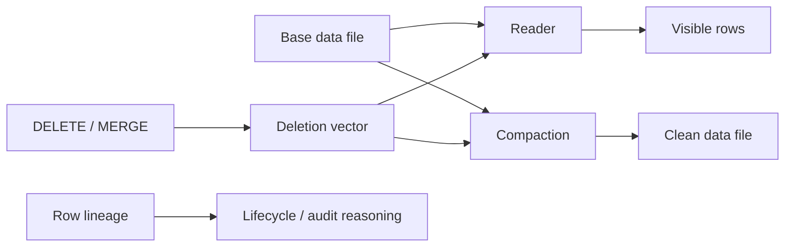

# Apache Iceberg V3: Deletion Vectors, Row Lineage & Mutation Economics

## Temel fikir
Iceberg V3 deletion vectors (DV), row-level silme bilgisini data file'ı her mutation'da yeniden yazmadan temsil etmeye yardım eder. Row lineage ise row identity/lifecycle bilgisini mutation zinciri boyunca taşımaya yönelik format primitive'leri sunar. Sonuç, write amplification ile read amplification arasında bilinçli bir takastır.

## Mental model

Logical table state yalnız Parquet/data files değildir; snapshot, manifests, delete metadata ve lineage semantics birlikte değerlendirilir.

## Mutation economics
Copy-on-write küçük bir DELETE için büyük file rewrite edebilir. DV bu maliyeti erteleyebilir; buna karşılık reader base rows ile delete positions'ı birleştirir. Delete density ve DV sayısı büyüdükçe scan overhead artabilir. Compaction logical delete'leri yeni data file'a materialize eder: çok erken compaction write churn, çok geç compaction read amplification yaratır.

## Correctness ve compatibility
Concurrent DELETE/MERGE sırasında commit validation ve snapshot semantics kritik önemdedir. Format V3 desteği ile belirli Spark/Flink/PyIceberg/Go sürümünün bütün V3 özelliklerini doğru okuyup yazabilmesi aynı şey değildir. Upgrade öncesi engine/version capability matrix hazırlanmalıdır. Apache Iceberg 1.11.0 Mayıs 2026 release hattıdır; 1.10.2 DV merge/commit ve row-ID assignment correctness düzeltmeleri içerir.

## Mülakat soruları
1. DV neden copy-on-write DELETE'den ucuz olabilir?
2. Hangi koşulda DV read amplification yaratır?
3. Row lineage ile CDC neden aynı kavram değildir?
4. Snapshot isolation altında concurrent mutation'ı nasıl düşünürsün?
5. Staff: compaction threshold'unu nasıl seçersin?
6. Principal: mixed-engine fleet'te V3 upgrade governance nasıl yapılır?

## Production metrikleri
DV cardinality/data-file, delete density, scan overhead, rewritten bytes, compaction backlog, snapshot age, commit conflict, orphan files ve engine/version dağılımını izle. Threshold'u yalnız zamana değil workload ve cost sinyallerine bağla.

## Failure modes
DV'yi ücretsiz delete sanmak; stale reader; format-version ile feature support'u eşitlemek; cleanup/orphan correctness'ini ihmal etmek; DV density ölçmemek; kör takvimli compaction.

## Mini çalışma / proje
1 TB tablo ve günlük %0.2 DELETE + %1 MERGE için copy-on-write ve DV maliyet modelini kur. Ardından küçük V3 tabloda append → delete → merge → scan → compaction akışını deneyip snapshot başına file count, rewritten bytes ve query latency kaydet.

## Kaynaklar
- https://iceberg.apache.org/releases/
- https://iceberg.apache.org/blog/apache-iceberg-1-11-0-release/
- https://iceberg.apache.org/blog/apache-iceberg-go-0.6.0-release/
- https://iceberg.apache.org/spec/
