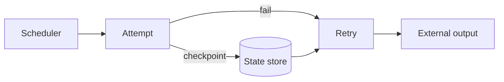

# Airflow Stateful Tasks, Durable Workflow State & Retry Semantics

## Neden önemli?
Task retry execution lifecycle'dır; durable application state ise attempt'ler arasında taşınan correctness bilgisidir. Worker-local state replacement, retry ve horizontal scaling altında güvenilir değildir.

Apache Airflow 3.3.0, AIP-103 ile task ve asset'ler için first-class state store getirdi. Incremental ingestion cursor'ları, pagination token'ları ve uzun süren workflow checkpoint'leri için orchestrator lifecycle ile durable state'i açıkça ayırmak gerekir.

## Mental model

## Interview derinliği
- Mid: retry, idempotency, ephemeral vs durable state.
- Senior: checkpoint ordering, concurrency, schema evolution, recovery.
- Staff: tenancy, namespace, quota, retention ve platform contract.
- CTO: managed-state değeri, governance ve lock-in.

## Failure modes ve trade-off
Checkpoint ile external side effect atomik değilse duplicate/lost-progress oluşabilir. Diğer riskler stale checkpoint, concurrent writers, state-store outage, unbounded growth ve state içine secret/PII sızmasıdır. State store correctness'i otomatik sağlamaz; side effect ile checkpoint arasında consistency protokolü gerekir.

## Production bağlantısı
Checkpoint age, retry count, duplicate rate, state read/write latency, state size ve recovery duration izle. Crash injection ile side-effect öncesi/sonrası recovery davranışını test et.

## Kaynaklar
- https://airflow.apache.org/blog/airflow-3.3.0/
- https://airflow.apache.org/announcements/
- https://airflow.apache.org/docs/
