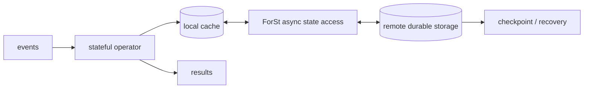

# Apache Flink Disaggregated State: ForSt, Async State I/O & Cloud-Native Recovery

## Neden önemli?
Stateful stream processing'de compute kolay taşınabilirken state placement, checkpoint ve recovery maliyetlidir. Compute ile state'i local disk üzerinden sıkı bağlamak hızlı hot-path sağlar; fakat büyük state, container/node churn, compaction spike ve rescale operasyonlarını zorlaştırır. Flink 2.x disaggregated state mimarisi bu bağı gevşetir.

## Mental model

**Invariant:** Durability'nin remote olması latency'nin bedava olduğu anlamına gelmez. Cache, async I/O ve backpressure aynı tasarımın parçalarıdır.

## Mimari
ForSt (“For Streaming”) state storage'ı compute'tan ayırmak için tasarlanmış backend'dir. Remote DFS/object-storage sınıfı sistemler durable state'i tutabilir. Remote lookup local disk/RAM'den daha yüksek latency'li olduğu için async state access birden fazla I/O'yu paralel yürütüp operator thread'in tek lookup üzerinde bloklanmasını azaltır.

Bu model dört ekonomiyi değiştirir:
1. **Placement:** state node'a daha az bağlıdır.
2. **Rescale/recovery:** dev state'in node-local kopyalarını taşımak yerine remote durable state yeniden kullanılabilir.
3. **Cache:** hot working set local cache'te tutulur; hit ratio tail latency için kritiktir.
4. **I/O concurrency:** latency hiding sağlar fakat limitsiz concurrency remote store throttling ve memory queue büyümesi doğurur.

## Checkpoint ve correctness
Disaggregated backend checkpoint'i hafifletebilir, fakat exactly-once semantiği yalnız backend özelliği değildir. Source offsets, checkpoint barriers/snapshots, operator state ve transactional/idempotent sink birlikte düşünülmelidir. “Checkpoint hızlı” ile “end-to-end exactly once” aynı iddia değildir.

## Capacity modeli
Basit expected lookup latency modeli `E[L] ≈ hit_rate*L_cache + miss_rate*L_remote` sezgisi verir; fakat p99 remote latency ve queueing yüzünden production capacity için yeterli değildir. Ölçülmesi gerekenler: cache hit/miss, remote p50/p95/p99, outstanding async requests, queue depth, backpressure, state bytes, checkpoint duration ve recovery time.

## Failure modes ve trade-off'lar
- Remote store'u sonsuz/bedava disk sanmak.
- Async concurrency'yi yalnız throughput için yükseltip queue/memory limitlerini unutmak.
- Cache warm-up sonrası recovery storm yaratmak.
- Remote throttling'i application backpressure'a bağlamamak.
- Average latency ile tail latency'yi gizlemek.
- Remote storage outage blast radius'unu multi-tenant platformda sınırlamamak.

## Mülakat soruları
1. Local state ile disaggregated state arasında hangi workload shape'lerinde seçim yaparsın?
2. Async I/O remote latency'yi nasıl gizler?
3. Cache hit ratio neden kritik?
4. 100 TB state'li job rescale edilirken bottleneck nerede oluşur?
5. Remote state store throttling'inde admission control/backpressure nasıl tasarlanır?
6. Principal: multi-tenant state platformunda quota ve blast-radius sınırları nasıl belirlenir?

## Seviyeye göre beklenen derinlik
- **Mid:** keyed state, checkpoint, local/remote ve cache.
- **Senior:** async concurrency, backpressure, recovery ve tail latency.
- **Staff:** workload-aware backend selection, rescale ve storage SLA/cost.
- **Principal:** platform quotas, migrations, durability, failure domains ve governance.

## Mini alıştırma
1 TB state, %95 cache hit, cache=0.2 ms, remote miss=20 ms p50 için expected latency hesapla. Sonra remote p99=200 ms olduğunda average'ın neden kapasite planı için yetersiz olduğunu açıkla. Concurrency 32→256 artışının throughput, queue ve remote throttling etkisini yaz.

## Proje
`state-backend-simulator`: Zipf key distribution, configurable cache, remote latency/failure ve async concurrency. Local-vs-disaggregated modlarda throughput, p50/p99, hit ratio, outstanding I/O, recovery ve rescale sürelerini karşılaştır.

## Production checklist
Cache hit ratio; remote read/write latency/errors; throttling; outstanding I/O; backpressure; checkpoint duration/failure; recovery time; state bytes; remote request/storage cost; cache warm-up süresi.

## Kaynaklar
- Apache Flink 2.0 — Disaggregated State Management / ForSt: https://flink.apache.org/2025/03/24/apache-flink-2.0.0-a-new-era-of-real-time-data-processing/
- Apache Flink stable releases: https://flink.apache.org/downloads/
