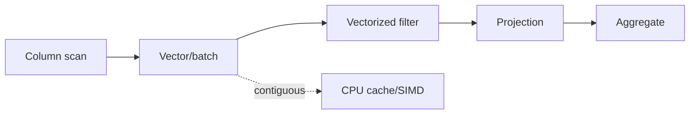

# Columnar Memory, Vectorized Execution & CPU Economics

## Konu anlatımı
Analytical query performansı yalnız algoritmik karmaşıklık değildir; memory layout, cache locality, bytes moved ve branch/function-call overhead belirleyicidir. Row layout point lookup/update için doğal olabilirken columnar layout aynı alanın değerlerini ardışık tutarak scan, compression ve vectorization için avantaj sağlar.

Apache Arrow columnar in-memory formatı sequential scan adjacency, O(1) random access, SIMD/vectorization-friendly layout ve zero-copy paylaşımı hedefler. DuckDB execution engine ise operator'ları tuple-at-a-time yerine `Vector` ve `DataChunk` üzerinde çalıştırır; belgelenen default standard vector size 2048 tuple'dır.

Mental model: **rows değil bytes moved + batches + cache misses + branches düşün.**

## Mülakat soruları
1. OLTP neden çoğunlukla row, OLAP neden columnar layout'tan yararlanır?
2. Column pruning I/O'yu nasıl azaltır?
3. Vectorized execution ve SIMD aynı şey midir?
4. Null bitmap/dictionary encoding'in maliyeti nedir?
5. Batch size çok küçük veya büyük olursa ne olur?
6. Arrow servisler arası copy/serialization maliyetini nasıl azaltabilir?

## Seviyeye göre cevap derinliği
- **Mid:** row/column, locality, scan, compression.
- **Senior:** vectorized operators, selection vectors, null handling, cache/SIMD.
- **Staff:** execution-vs-storage format, zero-copy boundary, interoperability, profiling.
- **Principal/CTO:** CPU-hour/scan-byte economics ve platform standardization.

## Mini alıştırma
100 sütunlu 1 TB logical tabloda yalnız dört eş genişlikte sütun okuyan query için idealized column-pruning byte oranını hesapla; compression ve selectivity'nin sonucu nasıl değiştirdiğini açıkla.

## Proje fikri
Aynı integer dataset üzerinde row-object ve contiguous column-array filter+sum benchmark'ı kur; farklı batch size'ları karşılaştır.

## Failure modes / trade-off / production
Columnar'ın her workload için üstün olduğunu varsaymak, tiny-query latency ile throughput'u karıştırmak, variable-width maliyetini yok saymak ve UDF ile vectorized pipeline'ı kırmak yaygın hatalardır. Scanned bytes, rows/s, CPU, decompression, spill ve batch occupancy izle. Büyük batch amortization'ı iyileştirirken cache footprint/latency'yi artırabilir; compression I/O'yu azaltırken CPU ekler; zero-copy ownership/lifetime disiplinini zorlaştırır.

## Kaynaklar
- Apache Arrow Columnar Format: https://arrow.apache.org/docs/format/Columnar.html
- DuckDB Execution Format: https://duckdb.org/docs/stable/internals/vector
- DuckDB Internals: https://duckdb.org/docs/stable/internals/overview
