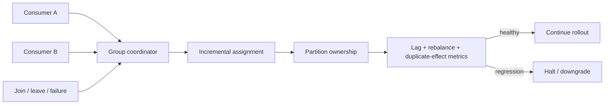

# Kafka Consumer Rebalance Protocol, Incremental Assignment & Migration

Kafka consumer group partition ownership'i üyeler arasında dağıtır; join/leave/crash veya subscription değişimi assignment'ı yeniden hesaplatır. Classic protokolde group-wide synchronization rebalance sırasında processing disruption ve lag spike yaratabilir. KIP-848 ile gelen yeni **Consumer rebalance protocol**, Kafka 4.0'dan beri GA'dır; fully incremental assignment ile global synchronization barrier'ını kaldırmayı ve büyük gruplarda rebalance süresini düşürmeyi hedefler.

## İçeride ne oluyor?

Yeni protokolde heartbeat interval, session timeout ve assignment strategy'nin daha fazlası broker tarafından yönetilir. Java consumer `group.protocol=consumer` ile opt-in eder. Online Classic → Consumer migration desteklenir; ancak classic assignor custom metadata embed ediyorsa interoperability mümkün olmayabilir. Protocol değişimi offset/side-effect correctness problemini ortadan kaldırmaz: revoke/assign boundary'sinde handler'ın idempotency ve commit contract'ı hâlâ kritiktir.

Nisan 2026'da kabul edilen KIP-1274 lifecycle yönünü netleştirir: Kafka 4.3'te Classic deprecation, 5.0'da Consumer protocol default ve 6.0'da KafkaConsumer'dan Classic desteğinin kaldırılması hedeflenir. Bu nedenle client inventory ve migration artık platform lifecycle işidir.

## Mülakat soruları

1. Consumer group hangi olaylarda rebalance olur?
2. Global rebalance barrier lag'i neden büyütebilir?
3. Incremental assignment hangi disruption'ı azaltır?
4. Heartbeat/session timeout'un broker'a taşınmasının avantajı ve maliyeti nedir?
5. Revoke/assign sırasında offset ve external side effect nasıl yönetilir?
6. Online migration hangi custom-assignor durumunda engellenebilir?
7. Staff: 500 üyeli grupta rollout gate'leri neler olur?
8. Principal: protocol lifecycle ve client fleet standardını nasıl yönetirsin?

## Beklenen cevap derinliği

- **Mid:** group, partition ownership, heartbeat, lag ve rebalance.
- **Senior:** incremental assignment, offset/side-effect boundary ve recovery.
- **Staff:** mixed-version rollout, custom assignor compatibility, telemetry, rollback.
- **Principal:** KIP-1274 lifecycle, platform standardı ve migration governance.

## Mini alıştırma

24 partition ve 6 consumer'lı gruba iki consumer ekle. Ownership değişimini çiz; Classic ve Consumer protocol için rebalance duration, lag ve duplicate-effect metriklerini karşılaştır.

## Proje fikri

`rebalance-lab`: join/leave/crash workload'u altında Classic ve Consumer protocol için rebalance duration, lag, assignment churn ve duplicate side effect ölçen benchmark.

## Failure modes / trade-off / production

Yanlış timeout tuning churn yaratır; slow handler progress'i bozar; non-idempotent side effect duplicate üretir; custom assignor migration'ı engeller; mixed fleet gözlenmeden rollout blast radius büyür. Rebalance count/duration, assignment churn, lag, processing latency, commit failure, duplicate effect ve membership izlenmelidir.

## Kaynaklar

- Apache Kafka — Consumer Rebalance Protocol: https://kafka.apache.org/43/operations/consumer-rebalance-protocol/
- Apache Kafka 4.0 release announcement: https://kafka.apache.org/blog/2025/03/18/apache-kafka-4.0.0-release-announcement/
- KIP-1274, accepted Apr 2026: https://cwiki.apache.org/confluence/spaces/KAFKA/pages/406619710/KIP-1274+Deprecate+and+remove+support+for+Classic+rebalance+protocol+in+KafkaConsumer
- Apache Kafka downloads: https://kafka.apache.org/community/downloads/
