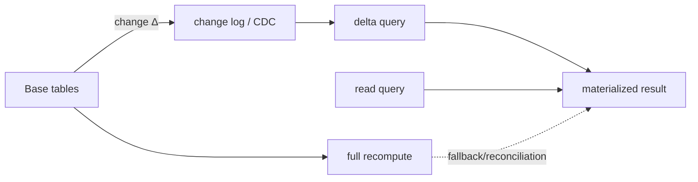

# Incremental View Maintenance, Delta Queries & Freshness

## Konu anlatımı
Materialized view pahalı bir query sonucunu fiziksel olarak saklayarak read latency'yi düşürür; bedeli freshness ve maintenance'tır. Full refresh backing query'yi yeniden çalıştırıp sonucu baştan üretir. **Incremental View Maintenance (IVM)** ise base table'daki değişikliğin view sonucuna etkisini — delta'yı — hesaplayıp yalnız gerekli insert/delete/update'ları uygular.

Basit örnek: `V = A JOIN B`. `A`'ya `ΔA` eklendiğinde bütün `A JOIN B`yi yeniden hesaplamak yerine yeni katkı yaklaşık `ΔA JOIN B` üzerinden bulunabilir. Aggregate'larda `SUM` ve `COUNT` gibi decomposable state incremental tutulabilir; `AVG` pratikte `sum/count` state'iyle güncellenebilir. DELETE, DISTINCT, MIN/MAX, outer join ve yüksek fan-out join'ler maintenance'i zorlaştırır.

Immediate maintenance freshness'i transaction'a yaklaştırır fakat write latency/contention ekler. Deferred/CDC-driven maintenance write path'i ayırır ve throughput'u artırabilir; karşılığında view lag, ordering ve replay correctness yönetilir. Doğru seçim freshness SLO, change volume ve recomputation maliyetine bağlıdır.

## Mental model

## İçeride ne oluyor?
1. Full refresh compute ve I/O'yu tüm dataset boyutuna bağlar; incremental maintenance change volume'a yaklaşmayı hedefler.
2. Delta algebra insert/delete değişimlerini view sonucuna propagate eder; joins diğer relation state'ine lookup gerektirir.
3. Aggregate maintenance için yardımcı state gerekebilir; `AVG` için sum+count tipik örnektir.
4. Immediate IVM base write transaction'ına ek iş koyar; deferred IVM log/CDC, ordering, checkpoint ve replay gerektirir.
5. Duplicate/replayed CDC event'leri idempotent delta application veya exactly-once state transition gerektirir.
6. Schema/query değişikliği incremental planı geçersiz kılabilir; backfill/rebuild stratejisi gerekir.
7. Periodic full reconciliation incremental bug veya missed event'e karşı correctness safety net olabilir.

## Yüksek getirili mülakat soruları
1. Normal view ile materialized view farkı nedir?
2. Full refresh ile IVM hangi workload'larda ayrışır?
3. `SUM`, `COUNT`, `AVG` neden incremental maintenance'e uygundur?
4. CDC-driven maintenance'de duplicate event'i nasıl güvenli uygularsın?
5. Senior: join fan-out'un delta cost'una etkisini nasıl tahmin edersin?
6. Staff: freshness SLO, write amplification ve replay/backfill tasarımını nasıl dengelersin?
7. Principal: serving DB, stream processor ve warehouse materialization arasında ownership'i nasıl bölersin?

## Beklenen cevap derinliği
- **Junior:** view/materialized view ve stale-data kavramını ayırır.
- **Mid:** full refresh ile delta maintenance cost modelini açıklar.
- **Senior:** joins, aggregates, CDC ordering/idempotency ve rebuild'i tartışır.
- **Staff/Principal:** freshness SLO, lineage, schema evolution, capacity ve reconciliation politikasını platform seviyesinde tasarlar.

## Kısa alıştırma
`daily_sales(day, total, count)` materialization'ı için `orders` tablosuna INSERT/DELETE geldiğinde delta update formüllerini yaz. `avg = total/count` üret. Aynı CDC event'i iki kez gelirse sonucu neden bozacağını ve nasıl dedupe edeceğini açıkla.

## Proje fikri
`ivm-lab`: PostgreSQL'de orders tablosu ve daily aggregate kur. Önce periodic `REFRESH MATERIALIZED VIEW`, sonra trigger veya CDC-benzeri change table ile incremental aggregate uygula. 1M satır + %0.1 change workload'unda refresh latency, write overhead, freshness lag ve correctness'i karşılaştır.

## Failure modes / trade-off / production
Delta pipeline event kaçırırsa view sessizce yanlış olabilir; replay duplicate üretirse aggregate drift eder; hot key contention write path'i boğabilir; high-fanout join küçük input delta'yı büyük output delta'ya çevirebilir. Production'da source-to-view lag, delta batch size, apply latency, duplicate/drop counters, reconciliation mismatch, rebuild duration ve storage/write amplification izlenmelidir.

## Kaynaklar
- PostgreSQL 18 — REFRESH MATERIALIZED VIEW: https://www.postgresql.org/docs/18/sql-refreshmaterializedview.html
- PostgreSQL Wiki — Incremental View Maintenance: https://wiki.postgresql.org/wiki/Incremental_View_Maintenance
