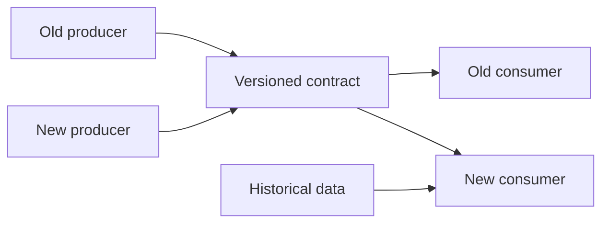

# Schema Evolution, Compatibility ve Data Contracts

## Temel problem
Distributed schema değişikliği mixed-version bir distributed-system problemidir. Producer, consumer, replayed event ve stored table files aynı anda farklı sürümlerde yaşayabilir. Doğruluk, old-writer/new-reader ve new-writer/old-reader kombinasyonlarında hem wire identity'nin hem business meaning'in korunmasını gerektirir.

## Mental model


## Protobuf identity
Protocol Buffers'ta field number wire identity'dir. Kullanılmış tag'i değiştirme veya yeniden kullanma. Silinen field numarasını `reserved` yap. İsim değişikliği wire format açısından tag değişikliğinden farklıdır; JSON/TextFormat gibi formatların ayrıca isim semantiği vardır.

## Iceberg identity
Iceberg kolonları unique field ID ile izler. Add/drop/rename/reorder ve desteklenen type promotion işlemleri metadata evolution olarak yapılabilir; stable ID rename/reorder sırasında eski verinin yanlış kolona bağlanmasını engeller.

## Data contract katmanı
Schema yalnız syntax/type değildir. Contract; owner, semantic meaning, null/default semantics, freshness, quality expectation, compatibility mode, deprecation window ve consumer obligations tanımlar.

Güvenli migration akışı:
```text
additive change -> mixed-version compatibility -> adoption telemetry
       -> optional dual read/write -> deprecate -> reserve/remove
```

## Mülakat soruları
- Backward ve forward compatibility farkı nedir?
- Protobuf tag neden yeniden kullanılmaz?
- Additive change hangi durumda semantic breaking olabilir?
- Historical replay migration'ı neden zorlaştırır?
- Iceberg field ID hangi correctness problemini çözer?
- Staff/Principal seviyesinde compatibility gate ve ownership nasıl kurulur?

## Seviye beklentisi
Mid compatibility yönlerini ve additive evolution'ı bilir. Senior replay, null/default semantics ve mixed-version rollout tasarlar. Staff CI registry/gate, deprecation ve blast-radius governance kurar. Principal org-wide contract standardı ve migration economics'i yönetir.

## Alıştırma ve proje
`email` alanından `primary_email` + `emails[]` modeline rollback-safe migration tasarla. Ardından iki proto/table schema snapshot'ını karşılaştırıp unsafe tag/field-ID reuse ve type change bulan `schema-compat-gate` CLI geliştir.

## Failure modes / production
Tag/ID reuse, nullable→required, enum meaning değişimi, default semantiğini değiştirme, consumer inventory'siz removal ve replay'i unutmak data corruption veya outage üretebilir. Schema version distribution, parse/unknown-field errors, DLQ, lag, null/default rate, old-version traffic ve deprecation deadline izlenmelidir.

## Kaynaklar
- Protocol Buffers Language Guide: https://protobuf.dev/programming-guides/editions/
- Protocol Buffers Best Practices: https://protobuf.dev/best-practices/dos-donts/
- Apache Iceberg Evolution: https://iceberg.apache.org/docs/1.9.0/evolution/
- Apache Iceberg Specification: https://iceberg.apache.org/spec/
