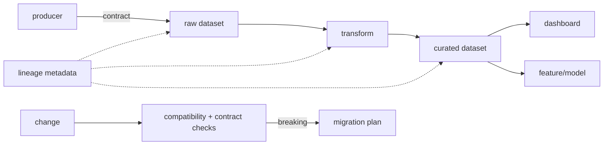

# Data Lineage, Impact Analysis & Contract Observability

## Temel problem
Pipeline `SUCCESS` olsa bile veri yanlış olabilir. Producer/consumer arasındaki schema ve semantic beklentileri contract ile; bir output'un nereden türediğini lineage ile; gerçek veri davranışını runtime quality/freshness checks ile görünür kılarız. Bu üçü birbirinin yerine geçmez.

## Mental model

## Contract, evolution ve lineage ayrımı
Contract schema'nın ötesinde ownership, field semantics, nullability, allowed values, freshness/volume expectation ve compatibility policy taşıyabilir. Additive change çoğu zaman daha güvenlidir ama `SELECT *`, positional mapping veya strict deserializer gibi consumer davranışları yine kırılabilir. Rename/drop/type narrowing genellikle migration ister.

Lineage dataset/job/run graph'i ve gerektiğinde field-level edge'leri taşır. OpenLineage metadata'yı Run, Job ve Dataset entity'leri ile facet'ler üzerinden ifade eder. Lineage bir quality kanıtı değildir: `customer_id` hangi upstream field'dan geldiğini bilmek, değerlerin doğru olduğunu garanti etmez.

Apache Iceberg schema evolution'da column identity'yi field ID ile izler; add/drop/rename/update/reorder gibi değişikliklerin önemli kısmı metadata seviyesinde yapılabilir. Bu, logical evolution ile fiziksel rewrite maliyetini ayırmak için iyi bir production örneğidir.

## Mülakat soruları
1. Schema ile data contract farkı nedir?
2. Additive change neden her zaman güvenli değildir?
3. Rename/drop migration'ını nasıl tasarlarsın?
4. Dataset-level ve field-level lineage ne zaman gerekir?
5. Senior: upstream değişiklik downstream dashboard'u sessizce bozuyorsa ne yaparsın?
6. Staff: yüzlerce pipeline'da contract enforcement ve lineage capture nasıl platformlaştırılır?
7. Principal: lineage coverage, governance ve change velocity arasında nasıl politika kurarsın?

## Seviye beklentisi
Mid compatibility ve lineage graph'i bilir. Senior migration, runtime quality, replay/backfill ve ownership'i ekler. Staff CI enforcement, catalog/lineage platformu ve blast-radius analysis kurar. Principal org-wide contract policy, compliance, cost ve developer UX'i birlikte yönetir.

## Mini alıştırma
`orders(order_id, user_id, total_cents)` için `user_id → customer_id` rename ve cents → decimal currency dönüşümü tasarla. Eski/yeni consumer'ların birlikte yaşayacağı expand/migrate/contract planını ve lineage edge'lerini çiz.

## Proje fikri
`data-contract-lab`: producer → transform → analytics pipeline kur. Contract check, freshness/null checks ve OpenLineage-compatible event üretimi ekle. Breaking rename'i CI'da durdur; migration sonrası impact graph ile etkilenen consumer'ları raporla.

## Failure modes / production
Schema registry'yi tam contract sanmak, additive değişikliği koşulsuz güvenli kabul etmek, lineage'ı yalnız dashboard görseli olarak toplamak, owner/freshness tanımlamamak ve enforcement'i bypass edilebilir bırakmak tipik hatalardır. Production'da contract violations, freshness lag, null/range anomalies, lineage coverage, failed consumers, backfill cost ve mean-time-to-impact-analysis birlikte izlenir.

## Kaynaklar
- OpenLineage documentation: https://openlineage.io/docs/
- OpenLineage dataset lineage facet: https://openlineage.io/docs/spec/facets/dataset-facets/lineage/
- OpenLineage job lineage facet: https://openlineage.io/docs/spec/facets/job-facets/lineage/
- Apache Iceberg schema evolution: https://iceberg.apache.org/docs/latest/evolution/
