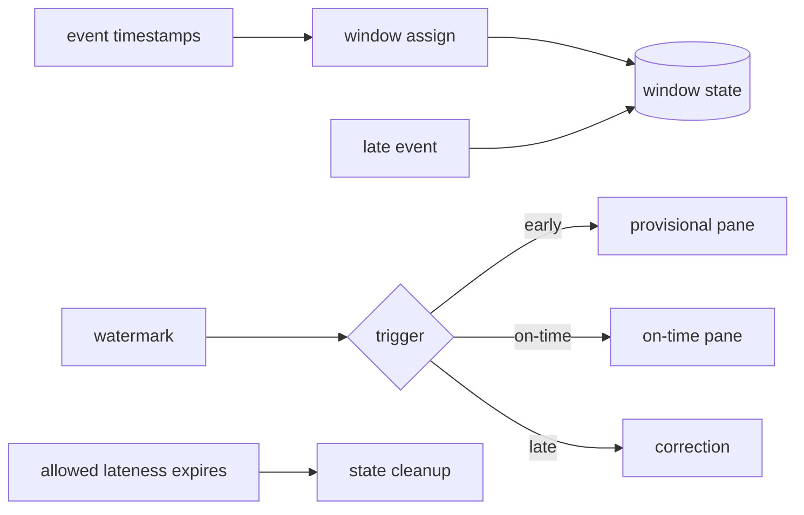

# Event Time, Watermarks, Late Data & Triggers

## Neden önemli?
Streaming'de event time, ingestion time ve processing time aynı değildir. Network gecikmesi, offline clients ve partition backlog yüzünden arrival order event-time order olmayabilir. Window aggregation'ın kritik sorusu bu yüzden yalnız 'hangi pencere?' değil, 'ne zaman yeterince tamamlandı ve geç veriyle ne yapacağız?'dır.

## Mental model

Watermark duvar saati değil, pipeline'ın event-time progress tahminidir. Window muhasebe dönemi; early firing ön rapor, late firing düzeltme fişidir.

## İçeride ne oluyor?
- Timestamp extractor event-time'ı kayda bağlar; window assigner state scope'unu belirler.
- Parallel source/operator watermark birleşiminde yavaş veya idle partition global ilerlemeyi tutabilir.
- Watermark window sonunu geçtiğinde event-time trigger on-time pane üretebilir.
- Allowed lateness boyunca state tutulabilir; late event correction/re-firing yaratabilir.
- Accumulating vs discarding panes downstream sink semantics'ini değiştirir.
- Geniş lateness completeness'i artırırken state/cost'u; dar lateness latency'yi iyileştirirken late-drop/correction riskini artırır.

## Mülakat soruları
1. Event time ile processing time farkı nedir?
2. Watermark kesin saat midir, progress sinyali midir?
3. Idle partition watermark'ı neden tutabilir?
4. Allowed lateness nasıl seçilir?
5. Accumulating vs discarding trigger sink'i nasıl etkiler?
6. Staff: correction isteyen billing pipeline'ında end-to-end semantics'i nasıl kurarsın?

## Beklenen cevap seviyesi
- **Junior:** event/processing time ve window.
- **Mid:** watermark, out-of-order, late data.
- **Senior:** triggers, idleness, retention, upsert/idempotency.
- **Staff:** business correctness, replay/backfill, SLO ve state/cost governance.

## Mini alıştırma
10:00–10:05 window'u için watermark 10:06'ya ilerledikten sonra event-time 10:04:30 kayıt gelsin. Allowed lateness 0 ve 5 dakika durumlarını karşılaştır; correction varsa sink idempotency/upsert tasarımını yaz.

## Proje fikri
`watermark-lab`: out-of-order event generator ve fixed windows kur; delay dağılımını değiştirerek watermark lag, late-event ratio, retained state ve correction count ölç. Idle partition senaryosu ekle.

## Failure modes / trade-off / production bağlantısı
Aggressive watermark veri completeness'ini bozabilir; konservatif watermark latency ve state'i büyütür. Idle partition ilerlemeyi dondurabilir. Non-idempotent sink late firing ile double count yaratabilir. Watermark lag, late/drop ratio, state size, checkpoint duration, source lag ve correction rate birlikte izlenmelidir.

## Kaynaklar
- Apache Beam Programming Guide: https://beam.apache.org/documentation/programming-guide/
- Apache Flink — Debugging Event Time: https://nightlies.apache.org/flink/flink-docs-stable/docs/ops/debugging/debugging_event_time/
- Apache Flink — Windows / allowed lateness: https://nightlies.apache.org/flink/flink-docs-release-1.19/docs/dev/datastream/operators/windows/
