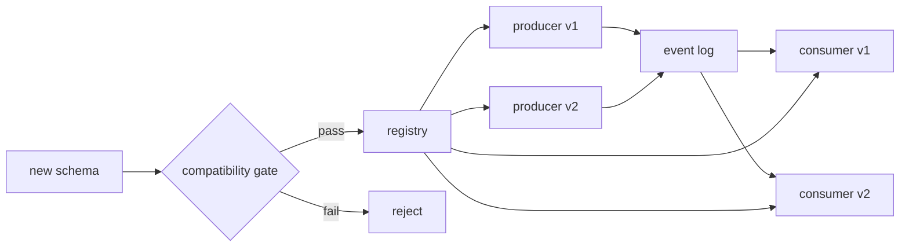

# Schema Evolution, Compatibility & Reader/Writer Contracts

## Neden önemli?
Event-driven sistemlerde producer ve consumer aynı anda deploy edilmez; eski kayıtlar replay/backfill ile yeniden okunabilir. Şema bu nedenle yalnız veri şekli değil, zamana yayılmış bir kontrattır.

## Mental model

Registry = distributed deploy'lar için compile-time benzeri guardrail. Compatibility yönü hangi zaman yönündeki producer/consumer kombinasyonunun birlikte çalışacağını tanımlar.

## Temel kavramlar
- Avro **writer schema** payload'ın yazıldığı şemadır; **reader schema** consumer'ın beklediği şemadır.
- Schema resolution iki sürüm arasındaki alan/type farklarını çözer.
- `BACKWARD`: yeni reader eski writer verisini okuyabilmelidir.
- `FORWARD`: eski reader yeni writer verisini okuyabilmelidir.
- `FULL`: iki yönü birlikte ister.
- `TRANSITIVE`: yalnız son sürüm değil geçmiş sürümlerle de compatibility kontrolü yapar.
- Retention/replay horizon hangi compatibility politikasının güvenli olduğunu etkiler.

## Production akışı
1. Producer schema ID/version ile serialize eder.
2. Consumer writer schema'yı ID üzerinden bulur.
3. Reader/writer resolution uygulanır.
4. Yeni schema registration compatibility gate'ten geçer.
5. CI/CD aynı testi deployment öncesi çalıştırabilir.
6. Replay testleri eski payload'ların gerçekten okunabildiğini doğrular.

## Mülakat soruları
1. Backward ve forward compatibility farkı nedir?
2. Neden yalnız latest schema ile kontrol uzun retention'da yetersiz olabilir?
3. Writer schema / reader schema ayrımı neden önemlidir?
4. Field eklemek ne zaman breaking olur?
5. Enum/union değişiklikleri neden risklidir?
6. Yüzlerce consumer için migration sequencing nasıl tasarlanır?
7. Organization-wide data-contract governance nasıl kurulmalıdır?

## Seviyeye göre cevap derinliği
- **Mid:** optional/default field, schema ID, backward/forward.
- **Senior:** reader/writer resolution, mixed-version deploy, replay ve CI gate.
- **Staff:** transitive policy, ownership, subject strategy ve migration sequencing.
- **Principal:** governance, lineage, retention economics ve blast radius.

## Kısa alıştırma
`OrderCreated{id,total}` şemasına `currency` ekle. Eski kayıtların replay edildiğini ve eski consumer'ların 48 saat daha çalışacağını varsay. Default/optional kararını ve compatibility modunu gerekçelendir.

## Proje
Avro + registry ile v1→v2 field add/remove/type-change senaryolarını CI compatibility testi, mixed-version consumer ve replay testiyle doğrula.

## Failure modes / trade-off
Wire compatibility semantic compatibility değildir. Aynı integer alanın anlamını cents'ten dollars'a çevirmek registry'den geçse bile consumer'ı bozabilir. Yanlış default business hatası yaratabilir. Non-transitive policy uzun retention'da eski veriyi kırabilir.

## Production gözlemleri
Schema-registration failures, deserialize errors, unknown schema IDs, consumer lag, replay/backfill failures ve schema-version dağılımını izle.

## Kaynaklar
- Apache Avro 1.12 specification: https://avro.apache.org/docs/1.12.0/specification/
- Confluent Schema Evolution: https://docs.confluent.io/platform/current/schema-registry/fundamentals/schema-evolution.html
- Confluent Schema Registry API: https://docs.confluent.io/platform/current/schema-registry/develop/api.html
