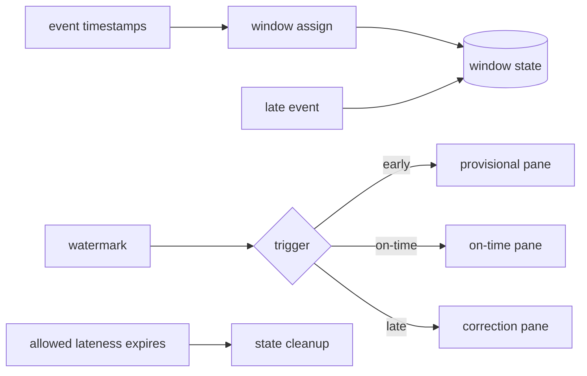

# Event Time, Watermarks, Late Data & Triggers

## Problem
Streaming'de event time olayın gerçekleştiği, ingestion time sisteme girdiği, processing time operator tarafından işlendiği zamandır. Network delay, offline client ve partition backlog'u yüzünden arrival order event-time order değildir. Window aggregation bu nedenle 'pencere ne zaman tamamlandı?' sorusuna açık bir politika ister.

## Mental model

Watermark duvar saati değil, pipeline'ın event-time ilerlemesine dair progress tahminidir. Window muhasebe dönemi, early firing ön rapor, late firing düzeltme fişi, allowed lateness ise defteri ne kadar süre açık tutacağındır.

## İçeride ne oluyor?
1. Timestamp extraction event-time'ı kayda bağlar; window assigner state sınırını belirler.
2. Parallel source/operator watermark'ları birleşirken en gerideki partition ilerlemeyi tutabilir.
3. Flink'te current input watermark upstream watermark'ların minimumundan etkilenir; idle input detection bu yüzden önemlidir.
4. Watermark window sonunu geçince event-time trigger on-time pane üretebilir.
5. Allowed lateness boyunca window state tutulabilir ve late event correction/re-firing yaratabilir.
6. Accumulating panes önceki state'i yeni output'a dahil eder; discarding panes yalnız yeni pane içeriğini çıkarır. Sink semantics buna uygun olmalıdır.
7. Çok konservatif watermark latency/state maliyetini; agresif watermark late/drop oranını artırır.

## Correctness ve sink sınırı
Late correction üreten pipeline'da downstream append-only sink kolayca double count yaratır. Upsert key, idempotent write veya revision semantics'i gerekir. Replay/backfill'in aynı logical result'u üretmesi için event-time, window identity ve output keys deterministik olmalıdır.

## Mülakat soruları
- Event time ve processing time farkı nedir?
- Watermark neyi garanti/tahmin eder?
- Idle Kafka partition watermark'ı neden tutabilir?
- Allowed lateness nasıl seçilir?
- Accumulating vs discarding panes sink'i nasıl etkiler?
- Staff: billing pipeline'ında late correction ve replay semantics'ini nasıl kurarsın?

## Beklenen cevap derinliği
- **Junior:** event/processing time ve window.
- **Mid:** watermark, out-of-order ve late data.
- **Senior:** triggers, idleness, retention ve idempotent/upsert sink.
- **Staff:** business correctness, replay/backfill, SLO ve state/cost governance.

## Kısa alıştırma
10:00–10:05 window'u için watermark 10:06 iken event-time 10:04:30 kayıt gelsin. Allowed lateness 0 ve 5 dakika için sonucu karşılaştır; correction halinde sink key/revision modelini tanımla.

## Proje fikri
`watermark-lab`: out-of-order event generator + fixed windows kur. Delay dağılımını değiştirerek watermark lag, late/drop ratio, retained state ve correction count ölç; idle partition ekle.

## Failure modes / production
Aggressive watermark completeness kaybı, konservatif watermark yüksek latency/state üretir. Idle partition progress'i dondurabilir. Non-idempotent sink late firing ile double count yaratabilir. Watermark lag, late/drop ratio, state size, checkpoint duration, source lag ve correction rate birlikte izlenmelidir.

## Kaynaklar
- Apache Beam Programming Guide: https://beam.apache.org/documentation/programming-guide/
- Apache Flink stable — Debugging Windows & Event Time: https://nightlies.apache.org/flink/flink-docs-stable/docs/ops/debugging/debugging_event_time/
- Apache Flink — Windows / Allowed Lateness: https://nightlies.apache.org/flink/flink-docs-release-1.19/docs/dev/datastream/operators/windows/
