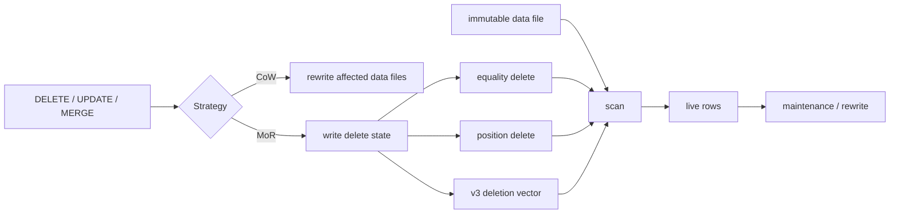

# Apache Iceberg Row Deletes, Deletion Vectors & Merge-on-Read

**Seviye:** Mid → Principal  
**Alan:** Data Engineering / Storage

## Konu anlatımı
Immutable columnar data files üzerinde tek satır silmek pahalıdır. **Copy-on-write (CoW)** affected data files'ı rewrite eder; read path sade kalır fakat küçük mutation için yüksek write amplification yaratabilir. **Merge-on-read (MoR)** data file'ı hemen rewrite etmek yerine delete metadata yazar; reader scan sırasında data + delete state'i birleştirir.

Iceberg v2 position ve equality delete files kullanabilir. Position delete fiziksel `(file, row-position)` kimliğine, equality delete logical key equality'ye dayanır. Iceberg v3'te position deletes **deletion vector (DV)** biçiminde temsil edilir. DV tek bir `referenced_data_file` içindeki deleted row positions bitmap'idir; Puffin `deletion-vector-v1` Roaring bitmap serialization kullanır.

Bu tasarım mutation write cost'unu düşürebilir ama scan-time filtering, metadata ve maintenance debt yaratır. Doğru sistem tasarımı yalnız DELETE latency'sine değil, delete density, query mix, compaction cadence ve engine interoperability'ye bakar.

## Mental model

## İçeride ne oluyor?
1. Planner identifies rows/files affected by a mutation.
2. CoW rewrites affected data files and atomically commits a new snapshot.
3. MoR records deletes separately instead of rewriting immediately.
4. Equality delete carries equality field IDs; reader compares logical keys.
5. Position delete binds file path + row position.
6. DV stores positions as bitmap and references one data file.
7. Scan planning applies delete state according to file, partition and sequence-number scope.
8. Reader filters deleted rows while scanning immutable data.
9. Maintenance/rewrite eventually collapses data + delete state to control read amplification.

## Correctness invariants
- Delete scope must match partition/spec and sequence-number rules.
- Equality deletes apply only to sufficiently older data sequence numbers; position deletes/DVs can apply to same-commit data under spec rules.
- A DV references exactly one data file and must contain the position-delete state it supersedes.
- Compaction/rewrite must preserve snapshot semantics while replacing files/delete state.

## Mülakat soruları
1. CoW ve MoR delete arasındaki temel trade-off nedir?
2. Equality delete ile position delete ne zaman tercih edilir?
3. DV için bitmap neden uygundur?
4. Sequence number delete correctness'inde neden önemlidir?
5. DV write amplification'i azaltırken read amplification'i nasıl artırır?
6. Senior: compaction delete semantics'i nasıl korur?
7. Staff: high-update table için policy'yi workload'a göre nasıl seçersin?
8. Principal: v2→v3 upgrade ve heterogeneous engine interoperability rollout'unu nasıl yönetirsin?

## Beklenen cevap derinliği
- **Mid:** immutable files, snapshot, CoW/MoR ve delete-file farkını açıklar.
- **Senior:** position/equality/DV application, sequence numbers ve compaction correctness'i anlatır.
- **Staff:** write/read amplification, scan planning, maintenance cadence ve engine support matrix'ini bağlar.
- **Principal:** format upgrade, rollback, interoperability, cost/SLO ve governance kararlarını tartışır.

## Kısa alıştırma
1 GB Parquet dosyasında yalnız 100 satır siliniyor. CoW ve MoR/DV için write bytes, sonraki scan maliyeti ve maintenance debt'i nitel olarak karşılaştır. Delete oranı %40 olduğunda kararın neden değişebilir?

## Proje fikri
`iceberg-delete-lab`: küçük bir Iceberg table kur; CoW ve MoR mutation workload'larını çalıştır. Snapshot metadata, delete-file/DV count, scan bytes, p50/p95 query latency ve compaction sonrası durumu karşılaştır; kullandığın engine'ler için format-feature support matrix'i çıkar.

## Failure modes / trade-off / production
Delete metadata uygulanmazsa deleted rows yeniden görünür; yanlış sequence/partition scope correctness bug'ıdır. Çok sayıda delete artifact scan planning ve read CPU'yu artırır. High delete density'de rewrite daha ucuz olabilir. Compaction concurrent mutations ile snapshot isolation altında koordine edilmelidir. Production'da delete-file/DV count, deleted-row cardinality, scan-planning time, read amplification, file-size distribution, compaction backlog, snapshot age ve engine/version compatibility izlenmelidir.

## Kaynaklar
- Apache Iceberg Specification: https://iceberg.apache.org/spec/
- Puffin deletion-vector-v1: https://iceberg.apache.org/puffin-spec/
- Apache Iceberg implementation status: https://iceberg.apache.org/status/
- Flink maintenance / equality-delete→DV conversion: https://iceberg.apache.org/docs/nightly/flink-maintenance/
