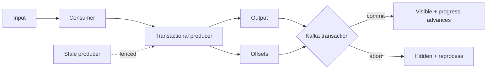

# Kafka Transactions, Producer Fencing & Exactly-Once Boundaries

**Seviye:** Mid → Principal  
**Alan:** Data Engineering / Distributed Systems

## Neden önemli?
“Exactly once” ifadesi atomic boundary belirtilmeden eksiktir. Kafka'da producer retry deduplication ile consume-process-produce atomikliği farklı problemlerdir; harici DB/API side effect'leri ise ayrıca çözülmelidir.

## Mental model

## Mekanizma
Idempotent producer broker'ın producer identity/sequence state'iyle retry duplicate'larını bastırır. Transactional producer birden çok partition write'ını ve consumer-group offset ilerlemesini tek transaction'a alabilir. `read_committed` consumer aborted transaction kayıtlarını uygulama görünümünden çıkarır. `transactional.id` restart ve stale-writer senaryolarında fencing modelinin parçasıdır.

Consume-transform-produce akışında temel invariant şudur: output commit olduysa karşılık gelen input offset de commit olmalı; transaction abort olduysa ikisi de ilerlememelidir. Rebalance sırasında partition ownership değiştiği için stale worker'ın sonucu commit etmesine izin verilmemelidir.

Kafka transaction'ı harici PostgreSQL write'ı, payment API çağrısı veya e-posta gönderimiyle otomatik atomic değildir. Bu sınırda sink transaction'ı, idempotency key, deduplication, transactional outbox veya başka coordination modeli gerekir.

## Mülakat soruları
1. Idempotent producer ile transactional producer farkı nedir?
2. `read_committed` neyi değiştirir?
3. Offset ile output neden aynı transaction'a alınır?
4. Producer fencing hangi stale-writer problemini çözer?
5. Rebalance transaction ortasında olursa ne yaparsın?
6. Kafka → DB pipeline'ında exactly-once iddiasını nasıl sınırlandırırsın?
7. Transaction timeout, batch size ve throughput trade-off'u nedir?

## Beklenen cevap derinliği
- **Mid:** idempotence, transaction, offset ve isolation rollerini ayırır.
- **Senior:** abort/retry, rebalance ve fencing'i açıklar.
- **Staff:** external side-effect sınırını ve outbox/idempotency seçeneklerini tartışır.
- **Principal:** correctness contract'ını latency, broker load, recovery ve operability ile birlikte yönetir.

## Alıştırma
100–109 offsetlerini consume edip output yazdıktan sonra process'in offset commit öncesi öldüğünü düşün. At-least-once ve transactional consume-transform-produce modellerini karşılaştır. Sonra harici payment API ekleyip neden Kafka transaction'ının tek başına yeterli olmadığını açıkla.

## Proje
İki topic arasında transactional copier kur. Forced abort, process kill ve rebalance testleri ekle; `read_uncommitted` ile `read_committed` görünürlüğünü karşılaştır ve duplicate/loss invariant'larını otomatik doğrula.

## Failure modes / trade-off / production
Uzun transaction timeout/recovery maliyetini artırır. `transactional.id` yanlış paylaşılırsa fencing oluşur. `read_uncommitted` aborted kayıtları gösterebilir. External side effect'leri Kafka EOS kapsamındaymış gibi sunmak correctness hatasıdır. Transaction abort/error oranı, fencing exceptions, consumer lag, rebalance, transaction duration ve business invariant'ları birlikte izlenmelidir.

## Kaynaklar
- Apache Kafka 4.1 Design — Using Transactions: https://kafka.apache.org/41/design/design/
- Apache Kafka 4.2 Introduction: https://kafka.apache.org/42/getting-started/introduction/
