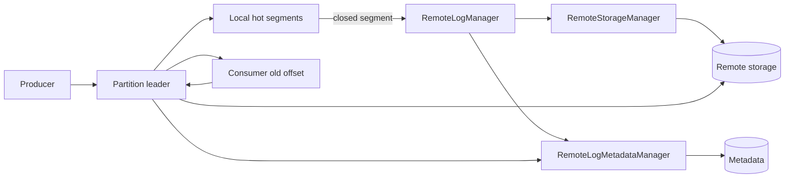

# Kafka Tiered Storage, Remote Log Metadata & Cold-Read Economics

**Seviye:** Mid → Principal | **Alan:** Data Engineering / Distributed Systems

## Konu anlatımı
Kafka Tiered Storage (KIP-405), uzun retention'ın broker-local disk kapasitesine doğrudan bağlanmasını azaltmak için log'u local/hot ve remote/cold katmanlara ayırır. Aktif ve yakın segmentler broker diskinde kalırken eligible kapalı segmentler remote storage'a taşınabilir. Client eski offset istediğinde broker remote path'i transparan kullanır; client API'sinin değişmesi gerekmez.

Bu tasarım kapasite maliyetini azaltabilir fakat yeni bir SLO ekseni getirir: hot-tail latency ile cold replay latency aynı değildir. Remote object-store request/throughput maliyeti, metadata correctness, backfill storms ve remote outage artık sistem tasarımının parçasıdır.

## Mental model

## Internals
- Cluster düzeyinde `remote.log.storage.system.enable`, topic düzeyinde `remote.storage.enable` kullanılır.
- `local.retention.ms/bytes` local hot window'u, `retention.ms/bytes` toplam retention'ı belirler.
- `RemoteStorageManager` remote segment byte/index lifecycle'ını soyutlar.
- `RemoteLogMetadataManager` segment metadata'sını strong-consistency semantics ile takip eder; varsayılan implementation internal topic kullanır.
- Normal hot reads local/page-cache yolunda kalırken replay/backfill remote fetch'e düşebilir.
- Leader/follower değişimleri sırasında data ve metadata lifecycle'ın birlikte doğru ilerlemesi gerekir.

## Mülakat soruları
1. Tiered storage hangi compute/storage coupling problemini azaltır?
2. Local retention ile total retention neden ayrıdır?
3. RSM ile RLMM sorumlulukları nedir?
4. Client neden değişmeden cold data okuyabilir?
5. Senior: Local window'u consumer-lag dağılımından nasıl seçersin?
6. Staff: Remote-store outage ve replay storm için isolation/quota nasıl tasarlanır?
7. Principal: SSD, object-store ve DR maliyetini tek capacity modelinde nasıl kıyaslarsın?

## Beklenen cevap seviyesi
- **Mid:** hot/cold segment ve retention ayrımını bilir.
- **Senior:** metadata, cold latency ve replay trade-off'unu açıklar.
- **Staff:** leader changes, quotas, outage isolation ve observability tasarlar.
- **Principal:** retention economics, RTO ve workload classes'ı platform stratejisine bağlar.

## Mini alıştırma
4 TB/gün topic, 30 gün total retention ve 2 gün local window için tiering öncesi/sonrası local logical footprint'i karşılaştır. Sonra 30 günlük replay'in object-store read path ve broker throughput'a etkisini listele.

## Proje fikri
`kafka-tiered-storage-lab`: kısa local retention ve küçük segment size ile offload'u gözle; offset 0 cold fetch'i doğrula; hot/cold p95, disk footprint ve remote request sayısını ölç.

## Failure modes / trade-off / production
Backfill storm remote request/throughput maliyetini büyütebilir; yanlış local window normal consumer lag'ini cold path'e iter; metadata problemi remote offset lookup'u bozabilir; remote outage hot-tail path'ten izole edilmelidir. Local-vs-remote fetch rate, remote latency/error, offload backlog, metadata lag, disk headroom, consumer lag ve cost/TB-month izlenmelidir.

## Kaynaklar
- Apache Kafka — Tiered Storage: https://kafka.apache.org/43/operations/tiered-storage/
- Apache Kafka — Tiered Storage GA Release Notes: https://cwiki.apache.org/confluence/spaces/KAFKA/pages/315494647/Kafka+Tiered+Storage+GA+Release+Notes
