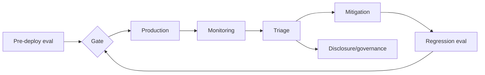

# Model Misalignment Reporting, Evaluation Gates & AI Incident Governance

## Neden önemli?
Production AI risk management yalnızca offline benchmark değildir. Yeni prompt dağılımları, tool access, uzun horizon ve sistem entegrasyonları modelin yeni failure mode'larını ortaya çıkarabilir. Capability eval, safety eval, runtime monitoring, incident triage ve disclosure ayrı ama bağlı kontrol döngüleridir.

16 Eylül 2026'da OpenAI, model misalignment örneklerini takip etme, araştırma ve raporlama için sistematik bir framework yayımladı. Sağlayıcıdan bağımsız temel mental model: beklenmeyen davranışı evidence + severity + affected surface + mitigation + regression eval zinciri olarak yönet.

## Mental model

## Interview derinliği
- Mid: eval set, metrics, false positive/negative ve monitoring.
- Senior: stratified eval, nondeterminism, trace capture ve mitigation validation.
- Staff: severity taxonomy, cross-product ownership ve release gates.
- EM/CTO: risk appetite, disclosure, regulatory exposure ve business continuity.

## Failure modes ve trade-off
Benchmark overfitting, eval contamination, average score'a aşırı güven, rare/high-impact event'leri kaçırma, telemetry'de hassas veri tutma ve safety mitigation'ın capability'yi aşırı düşürmesi. Governance'ın amacı sıfır incident iddiası değil; erken detection, containment, learning ve measurable recurrence reduction'dır.

## Production bağlantısı
Severity-bucket incident rate, tool-denial rate, human escalation, regression pass rate, policy-violation attempts ve mitigation latency izle. Incident kayıtlarında privacy-aware trace capture ve reproducible scenario set kullan.

## Kaynaklar
- https://openai.com/index/model-misalignment-reporting-framework/
- https://www.nist.gov/itl/ai-risk-management-framework
- https://www.nist.gov/publications/artificial-intelligence-risk-management-framework-generative-artificial-intelligence-profile
