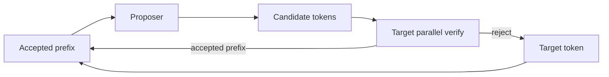

# Speculative Decoding, Acceptance Rate & Inference Economics

## Konu anlatımı
Autoregressive LLM decode token başına target-model forward pass'i gerektirir ve özellikle düşük/orta QPS'te memory-bandwidth bound olabilir. Speculative decoding, hızlı bir proposer'ın birkaç token önden üretip büyük target modelin bunları paralel doğrulamasıyla inter-token latency'yi düşürür. Doğru rejection/verification semantiğinde hedef target distribution'ı korumaktır.

Performans denklemi yalnız draft hızından ibaret değildir: draft cost + verification cost + acceptance length + batching/QPS + KV-cache footprint birlikte değerlendirilir. Düşük acceptance ekstra işi boşa çıkarabilir; yüksek QPS'te proposer compute throughput'u azaltabilir. Bu nedenle workload-segmented benchmark gerekir.

## Mental model

**Invariant:** pahalı target decode step'i başına kabul edilmiş token sayısını artırırken target sampling semantiğini koru.

## Mülakat soruları
1. Decode neden memory-bound olabilir?
2. Proposer/target rolleri nedir?
3. Acceptance length neden kritik metriktir?
4. Speculation depth neden monoton hız kazancı sağlamaz?
5. MTP ile ayrı draft model yaklaşımını karşılaştır.
6. Low-QPS latency ve high-QPS throughput tuning'i neden ayrılır?
7. Staff: benchmark/canary gate'leri nasıl kurulur?
8. Principal: workload-aware dynamic speculation policy nasıl tasarlanır?

## Beklenen cevap seviyesi
- **Mid:** propose → verify → accept/reject akışını doğru açıklar.
- **Senior:** acceptance, KV cache, batching ve latency/throughput trade-off'unu tartışır.
- **Staff:** request sınıfına göre benchmark, telemetry ve fallback tasarlar.
- **Principal:** GPU economics, capacity, model lifecycle ve adaptive policy'yi birlikte yönetir.

## Mini alıştırma
Baseline step maliyeti 1 ve step başına 1 token olsun. Speculative step maliyeti 1.35 iken ortalama 2.4 token çıkarıyorsa idealize speedup'ı hesapla; acceptance düşünce hangi varsayımın bozulduğunu yaz.

## Proje fikri
`spec-decode-lab`: vLLM ile farklı QPS/prompt/output sınıflarında n-gram ve model-based speculation benchmark'ı; TTFT, ITL, tokens/s, acceptance length ve GPU memory raporu.

## Failure modes / trade-off / production
Düşük acceptance negative ROI; draft memory capacity kaybı; batching ile etkileşim; numerical nondeterminism; representative olmayan benchmark temel risklerdir. Production'da TTFT, ITL, queue time, tokens/s, acceptance rate/length, GPU utilization/memory ve request segment'i birlikte izlenmelidir.

## Kaynaklar
- vLLM Speculative Decoding: https://docs.vllm.ai/en/stable/features/spec_decode/
- vLLM Per-Request Acceptance Metrics: https://docs.vllm.ai/en/latest/features/speculative_decoding/acceptance_metrics/
- vLLM Speculators: https://docs.vllm.ai/projects/speculators/en/stable/user_guide/getting_started/
