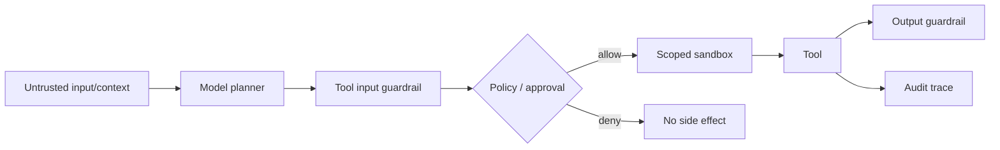

# Agent Sandboxes, Tool Guardrails & Side-Effect Boundaries

## Mental model
Bir agent tool call ürettiğinde model yalnız capability isteği önerir; yetki vermez. Güvenli sistemde policy ve execution plane ayrı trust boundary'dir.

## Capability modeli
Tool adı ve JSON schema güvenlik sınırı için başlangıçtır, yeterli değildir. Her effectful tool ayrıca resource scope, credential scope, network/filesystem boundary, idempotency ve approval policy taşımalıdır. Retrieved content veya prompt içindeki metin yeni capability yaratmamalıdır.

## Sandbox ne çözer?
Sandbox host filesystem/process/network blast radius'unu azaltabilir ve disposable workspace sağlar. Ancak broad cloud credential sandbox içine verilmişse sandbox o credential'ın yetkisini küçültmez. Aynı şekilde izinli network endpoint'i tehlikeli side effect kabul ediyorsa izolasyon authorization yerine geçmez.

15 Nisan 2026 tarihli OpenAI Agents SDK güncellemesi controlled sandbox ortamında file inspection, command execution ve code editing için native execution yaklaşımını duyurdu. Güncel SDK dokümanı SandboxAgent'ı manifest-defined files ve isolated workspace ile ayırır.

## Guardrail placement
- Input guardrail: ilk user input sınırı.
- Output guardrail: final agent output sınırı.
- Tool input guardrail: effect başlamadan tool/argument validation.
- Tool output guardrail: tool sonucunu modele dönmeden kontrol.

Blocking guardrail agent başlamadan tamamlanır; side effect riskinde daha güçlü sınırdır. Parallel guardrail latency avantajı sağlar fakat guardrail kararı gelmeden model/tool işi başlamış olabilir. Güncel Agents SDK dokümanı bu farkı açıkça belirtir.

## Approval ve idempotency
Human approval yüksek-impact ve seyrek operasyonlarda güçlü olabilir; her düşük-risk call'da approval fatigue üretir. Approval “bu exact action + exact scope” için olmalı. Retryable tool'larda business idempotency key gerekir; aksi halde timeout sonrası tekrar ödeme/deploy/ticket oluşturabilir.

## Tracing ve sensitive data
Agent trace'i model turn, tool call, handoff ve guardrail debugging için değerlidir. Ancak tool arguments/results secret veya PII içerebilir. Güncel Agents SDK tracing dokümanı sensitive data capture'ın ayrı ayarla kapatılabildiğini belirtir. Auditability ile data minimization birlikte tasarlanmalıdır.

## Mülakat soruları
1. Prompt injection ile authorization arasındaki fark nedir?
2. Sandbox neden least privilege'ın yerine geçmez?
3. Blocking vs parallel guardrail trade-off'u nedir?
4. Shell tool için minimum güvenli capability seti nedir?
5. Handoff privilege escalation nasıl engellenir?
6. Human approval nerede değerli, nerede zararlıdır?
7. Tool retry'sında duplicate side effect nasıl önlenir?
8. CTO seviyesinde agentic automation rollout governance nasıl kurulur?

## Seviye beklentisi
- **Senior:** injection, least privilege, sandbox, approval ve idempotency ayrımını kurar.
- **Staff:** tool-specific capability/policy, audit ve failure containment tasarlar.
- **Principal:** cross-agent trust, credential brokering, policy-as-code ve sandbox platform standardı kurar.
- **CTO:** risk tiering, data governance, human accountability, incident response ve economics'i bağlar.

## Production checklist
Default-deny egress/filesystem; short-lived scoped credential; explicit tool allowlist; schema + semantic validation; high-impact approval; idempotency; secret-redacted tracing; canary rollout; kill switch. Denied/approved calls, approval latency, duplicate suppression, tool error rate, egress attempts ve redaction coverage ölç.

## Kaynaklar
- OpenAI — The next evolution of the Agents SDK (15 Nisan 2026): https://openai.com/index/the-next-evolution-of-the-agents-sdk/
- OpenAI Agents SDK — Agents: https://openai.github.io/openai-agents-python/agents/
- OpenAI Agents SDK — Guardrails: https://openai.github.io/openai-agents-python/guardrails/
- OpenAI Agents SDK — Tracing: https://openai.github.io/openai-agents-python/tracing/
- OpenAI Agents SDK — MCP: https://openai.github.io/openai-agents-python/mcp/
