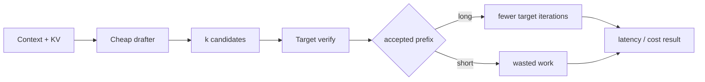

# Speculative Decoding, Acceptance Rate & Inference Economics

## Konu anlatımı
Autoregressive LLM decoding sequential target-model iterations gerektirir. Speculative decoding, daha ucuz bir proposer/drafter ile birkaç candidate token üretip target modelin bunları topluca doğrulamasını sağlar. Accepted prefix uzunsa output sequence tek target iteration'da birden fazla token ilerler.

Kazanç yalnız acceptance rate değildir. Drafter maliyeti, verification maliyeti, accepted progress, batch size, KV-cache baskısı ve target GPU utilization birlikte değerlendirilir. Medium/low QPS memory-bound serving'de speculation güçlü olabilir; yüksek batch throughput rejiminde target zaten verimli çalışıyorsa ek draft işi faydayı azaltabilir.

Güncel vLLM EAGLE, MTP, draft model, PARD, MLP, n-gram ve suffix yöntemlerini; per-request acceptance metrics'i destekler. TensorRT-LLM de birden fazla speculative yöntemi ve low-batch odaklı performans trade-off'larını belgeler.

## Mental model

**Invariant:** speculation semantics'i hız için değiştirmemeli; başarı `accepted progress / total draft+verify cost` üzerinden ölçülmelidir.

## İçeride ne oluyor?
- Proposer candidate token sequence üretir.
- Target candidate'ları birlikte doğrular.
- Correct rejection sampling teorik target distribution'ı koruyabilir.
- Draft depth arttıkça potential progress ve wasted-work riski birlikte artar.
- MTP native multi-token prediction yeteneğinden yararlanabilir.
- N-gram/suffix repetition üzerinden ucuz proposal üretebilir.
- Acceptance telemetry workload ve sampling parametrelerine göre segment edilmelidir.

## Mülakat soruları
1. Speculation autoregressive dependency'yi neden tamamen kaldırmaz?
2. %80 acceptance kesin speedup demek midir?
3. Draft/target tokenizer uyumu neden önemlidir?
4. Low-QPS ve high-batch rejimlerini karşılaştır.
5. MTP ile ayrı draft model yaklaşımını karşılaştır.
6. Senior: draft depth'i hangi metriklerle tune edersin?
7. Staff: scheduler ve KV cache ile speculation nasıl birlikte tasarlanır?
8. Principal/CTO: p99 ITL, GPU $/token ve complexity üzerinden adoption kararı nasıl verilir?

## Beklenen cevap seviyesi
- **Mid:** draft/verify/accept akışını açıklar.
- **Senior:** acceptance, batching, KV cache ve memory-bound rejimi tartışır.
- **Staff:** request routing, telemetry, canary ve scheduler interaction tasarlar.
- **Principal/CTO:** latency SLO, cost/token, compatibility ve operasyonel karmaşıklığı birlikte optimize eder.

## Mini alıştırma
Baseline ITL 45 ms. Speculation iteration 58 ms ve ortalama 2.2 token ilerliyorsa effective ITL'yi hesapla. Mean progress 1.1'e düşünce tekrar hesapla ve config'in neden trafik mix'ine göre dinamik seçilebileceğini açıkla.

## Proje fikri
`spec-decode-benchmark`: speculation kapalı, n-gram ve model-based proposer'ı QPS/batch/prompt repetition/temperature eksenlerinde karşılaştır. TTFT, p99 ITL, tokens/s, accepted length, GPU utilization, KV occupancy ve $/1M output token ölç.

## Failure modes / trade-off / production bağlantısı
Acceptance rate'i tek KPI yapmak, yalnız repetitive synthetic prompt test etmek, high-load throughput regresyonunu kaçırmak, tokenizer compatibility'yi doğrulamamak ve global tek config seçmek tipik hatalardır. Production'da TTFT/ITL, accepted-length distribution, reject rate, target iterations/output token, GPU utilization, KV pressure, queue delay ve cost/token birlikte izlenir.

## Kaynaklar
- vLLM Speculative Decoding: https://docs.vllm.ai/en/latest/features/spec_decode/
- vLLM Acceptance Metrics: https://docs.vllm.ai/en/latest/features/speculative_decoding/acceptance_metrics/
- NVIDIA TensorRT-LLM Speculative Decoding: https://nvidia.github.io/TensorRT-LLM/features/speculative-decoding.html
- Leviathan et al., ICML 2023: https://proceedings.mlr.press/v202/leviathan23a.html
