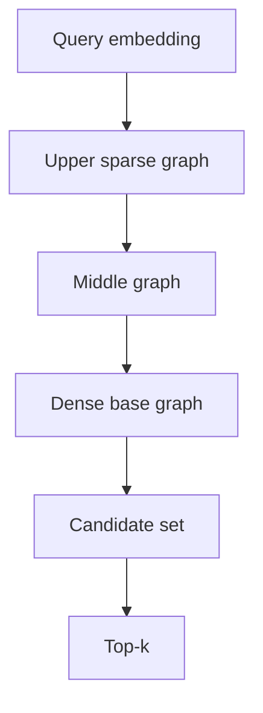

# Vector Search, HNSW, Recall–Latency Economics

**Seviye:** Mid → Principal  
**Alan:** ML/AI, Data, Retrieval

## Konu anlatımı
Embedding tabanlı retrieval, nesneleri yüksek boyutlu vektörlere dönüştürüp sorguya en yakın komşuları arar. Exact k-NN tüm adayları tarayarak doğru top-k'yi verir; ANN indeksleri küçük recall kaybını daha düşük latency/compute karşılığında kabul eder.

HNSW çok katmanlı proximity graph'tır. Üst katmanlar seyrek ve uzun mesafeli navigasyon, taban katmanı yoğun yerel arama sağlar. Search breadth yükseldikçe daha çok aday ziyaret edilir: recall genellikle artarken CPU ve tail latency de artar. Build-time graph connectivity de RAM/build time/search quality dengesini değiştirir.

## Mental model
HNSW'yi şehirler arası otoyol + mahalle sokakları gibi düşün: üst katman hızlıca doğru bölgeye götürür, alt katman yakın komşuları ayrıntılı tarar. Exact scan bütün evleri tek tek ziyaret etmektir.

## İçeride ne oluyor?
- Similarity metric embedding modelinin geometrisiyle uyumlu olmalıdır; cosine, inner product ve L2 farklı objective'lerdir.
- Exact top-k, ANN recall benchmark'ı için ground truth sağlar.
- HNSW node'ları hiyerarşik graph katmanlarına yerleşir; search üstten alta iner.
- Query breadth/`ef_search` arttıkça quality–latency frontier değişir.
- Metadata filtering approximate search'ten sonra uygulanırsa k'dan az sonuç kalabilir.
- pgvector 0.8.0+ iterative scans filtre sonrası yetersiz sonuçta index'i daha fazla tarayabilir.
- Multi-tenant index'te tenant skew recall/latency'yi etkileyebilir; partitioning veya ayrı index/table isolation gerekebilir.
- Embedding model upgrade'i versioned embeddings, dual index/read ve kontrollü cutover gerektirir.

## Yüksek getirili mülakat soruları
1. Exact k-NN ile ANN trade-off'u nedir?
2. HNSW neden hiyerarşik katman kullanır?
3. Recall@k nasıl ölçülür?
4. Search breadth artırılırsa hangi metrikler değişir?
5. Selective metadata filter ANN'de neden problem yaratır?
6. Senior: embedding model migration'ını downtime olmadan nasıl yaparsın?
7. Staff: 100M vektörlü multi-tenant sistem nasıl shard edilir?
8. Principal: recall, p99, RAM ve build-time için platform budget nasıl tanımlanır?

## Seviyeye göre cevap derinliği
- **Mid:** embedding, metric, exact-vs-ANN, recall.
- **Senior:** traversal, tuning, filtering, benchmark.
- **Staff:** sharding, isolation, versioning, recovery.
- **Principal:** quality/latency/cost frontier, capacity planning, migration governance.

## Kısa alıştırma
10.000 vektör ve 100 query oluştur. Exact top-10'u ground truth kabul et. Üç search-breadth seviyesinde recall@10, p50/p99 ve CPU ölç. Ardından %1 selectivity filter ekleyerek sonuç sayısı ve latency değişimini incele.

## Proje fikri
`ann-benchmark-lab`: exact scan ve HNSW'yi dataset size, dimension, k ve search breadth boyunca karşılaştır. Recall@k, QPS, p99, index RAM ve build time raporla. Embedding version alanıyla dual-index migration simüle et.

## Failure modes / trade-off / production bağlantısı
ANN'i exact sanmak, yanlış similarity metric kullanmak, yalnız average latency ölçmek, filter selectivity'yi benchmark'tan çıkarmak, model upgrade'inde embedding versiyonlarını karıştırmak ve tenant skew'ını yok saymak tipik hatalardır. Production'da recall sample, p95/p99, visited candidates, index size/build time, stale embedding ratio ve filter selectivity birlikte izlenir.

## Kaynaklar
- Malkov & Yashunin — HNSW: https://arxiv.org/abs/1603.09320
- pgvector: https://github.com/pgvector/pgvector
- PostgreSQL — pgvector 0.8.0 announcement: https://www.postgresql.org/about/news/pgvector-080-released-2952/
