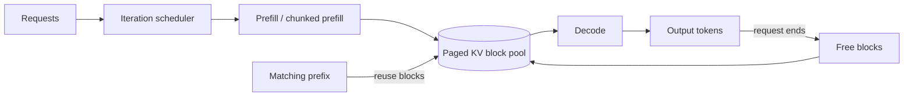

# KV Cache, PagedAttention, Continuous Batching & Prefix Reuse

**Seviye:** Mid → Principal  
**Alan:** ML/AI/LLM, MLOps, system performance

## Konu anlatımı
Autoregressive transformer serving'de **prefill** prompt token'larını işler ve attention key/value state üretir; **decode** ise her yeni token için önceki K/V değerlerini tekrar hesaplamak yerine KV cache'ten okur. Bu optimizasyon compute tekrarını azaltır ama serving kapasitesini GPU-memory problemine dönüştürür: aktif sequence sayısı ve context uzunluğu arttıkça KV state büyür.

Naif contiguous allocation, farklı request uzunluklarında memory fragmentation ve over-reservation yaratabilir. PagedAttention tarzı tasarım KV state'i sabit boyutlu blocks/pages halinde yönetir ve logical sequence'i fiziksel blocks'a map eder. Request büyüdükçe block eklenir; tamamlanan request'in blocks'u pool'a döner.

Continuous batching statik batch bariyerini kaldırır: scheduler decode iteration'ları arasında biten request'leri çıkarıp yeni request'leri admit edebilir. Prefix reuse/caching ise ortak system prompt veya tekrar eden prefix için daha önce hesaplanan KV blocks'u paylaşarak prefill compute'unu ve özellikle TTFT'yi azaltabilir.

## Mental model
Model weights ortak **kütüphane**, KV cache aktif request'in **çalışma notlarıdır**. Paged allocation her request'e baştan dev bir defter ayırmak yerine ihtiyaç oldukça sayfa verir. Continuous batching metro gibidir: bir yolcu indiğinde tüm trenin son durağa varmasını beklemeden yenisi binebilir.

## Temel mekanikler
- KV footprint yaklaşık olarak `tokens × layers × KV-heads × head-dim × K/V × bytes` ile ölçeklenir.
- GQA/MQA, query heads'e kıyasla daha az KV head kullanarak KV-memory/bandwidth maliyetini azaltabilir.
- Block size küçüldükçe fragmentation düşebilir ama allocator/metadata overhead'i artabilir.
- Scheduler compute budget yanında free KV blocks'u da admission constraint olarak kullanmalıdır.
- Prefix reuse için token prefix ve cache identity gerçekten eşleşmelidir; model/adaptor/config/tenant sınırları cache key tasarımına dahildir.
- Eviction reuse hit-rate'i ile yeni request admission kapasitesi arasında trade-off yaratır.
- Host/disk offload daha fazla reusable state tutabilir fakat transfer latency/bandwidth ekler.

## Mülakat soruları
1. KV cache hangi hesabı tekrar yapmayı önler?
2. Prefill ile decode neden farklı performans karakterine sahiptir?
3. PagedAttention hangi allocation/fragmentation sorununu hedefler?
4. Continuous batching neden statik batching'den daha yüksek utilization sağlayabilir?
5. Prefix caching hangi workload'da TTFT'yi ciddi düşürür?
6. Uzun-context request kısa request'leri nasıl starve edebilir?
7. Staff: TTFT SLO'su, ITL ve throughput'u scheduler'da nasıl dengelersin?
8. Principal: multi-tenant KV reuse için isolation ve cost/token politikasını nasıl kurarsın?

## Beklenen cevap seviyesi
- **Mid:** prefill/decode, KV cache, batching ve GPU memory ilişkisi.
- **Senior:** block allocation, fragmentation, prefix hit/miss, eviction, GQA/MQA ve latency decomposition.
- **Staff:** admission/fairness, scheduler policy, multi-GPU veya disaggregated serving, overload control.
- **Principal:** fleet capacity, tenant isolation, SLO tiers, model mix ve cost/token standardı.

## Mini alıştırma
Ortak 4K-token system prompt kullanan 100 request için prefix reuse kapalı/açık akışı çiz. Bir 64K-context request geldiğinde scheduler'ın hangi admission/fairness kararlarını vermesi gerektiğini ve TTFT/ITL üzerindeki etkisini tartış.

## Proje fikri
`llm-serving-scheduler-lab`: block-based KV allocator ve request scheduler simülatörü oluştur. Static batching ile continuous batching'i queue delay, utilization, wasted blocks ve TTFT proxy'sinde karşılaştır; prefix-hit ve eviction olaylarını ölç.

## Failure modes ve trade-off'lar
- Büyük blocks: internal fragmentation ve daha kaba prefix reuse.
- Küçük blocks: daha fazla metadata/scheduling overhead'i.
- Aggressive batching: yüksek throughput ama kötü TTFT/fairness.
- Yanlış cache identity: cross-tenant data leakage/correctness riski.
- Aşırı cache retention: yeni request admission'ını düşürür.
- Offload: kapasite artışı karşılığında PCIe/NVLink/host-memory latency ve bandwidth maliyeti.

## Production bağlantısı
KV utilization/free blocks, eviction ve prefix reuse rate, reusable-token oranı, queue depth, admission rejection, TTFT p50/p95/p99, ITL, output tokens/s ve GPU utilization birlikte izlenmelidir. Sadece tokens/s optimizasyonu interactive SLO'yu bozabilir.

## Kaynaklar
- vLLM documentation — PagedAttention, continuous batching, chunked prefill, prefix caching: https://docs.vllm.ai/en/stable/
- NVIDIA TensorRT-LLM — KV Cache System: https://nvidia.github.io/TensorRT-LLM/features/kvcache.html
- NVIDIA TensorRT-LLM — KV cache reuse: https://nvidia.github.io/TensorRT-LLM/latest/legacy/advanced/kv-cache-reuse.html
