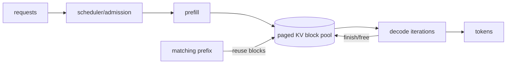

# KV Cache, Paged Attention, Continuous Batching & Prefix Reuse

## Neden önemli?
Autoregressive LLM serving'de performans yalnız model ağırlıklarına bağlı değildir. Aktif sequence'ların KV state'i GPU belleğini tüketir; scheduler'ın admission, batching ve cache politikası TTFT, ITL, throughput ve cost/token'ı doğrudan etkiler.

## Mental model
Model weights kütüphane, KV cache aktif okuyucuların çalışma notlarıdır. Paged allocation bu notları tek büyük contiguous defter yerine yeniden eşlenebilir bloklara böler. Continuous batching ise tamamlanan request'in yerini yeni request'in hemen alabildiği bir scheduler modelidir.

## Prefill ve decode
Prefill prompt token'larını işler ve layer'lar için K/V state üretir. Decode her yeni token'da geçmiş state'i yeniden hesaplamak yerine cache'ten okur. KV footprint kabaca token sayısı, layer sayısı, KV-head sayısı, head dimension ve dtype byte genişliğiyle büyür. GQA/MQA, KV-head sayısını azaltarak cache maliyetini düşürebilir.

## Paged allocation
Naif `max_context + max_new_tokens` contiguous reservation değişken request uzunluklarında fragmentation ve düşük concurrency yaratabilir. Block/page tabanlı allocator logical sequence'i fiziksel KV bloklarına map eder; request büyüdükçe blok alır, bittiğinde pool'a döndürür. Block size büyüdükçe metadata overhead azalabilir fakat internal fragmentation artabilir.

## Continuous batching ve admission
Statik batch bütün üyelerin bitmesini bekleyebilir. Continuous batching decode iteration'ları arasında biten sequence'ları çıkarıp yeni işleri admit eder. Scheduler compute kapasitesi kadar KV kapasitesini, request deadline'ını ve fairness'i de hesaba katmalıdır. Tek 64K-context request çok sayıda kısa request'i dışarı itebilir.

## Prefix reuse
Aynı token prefix'i tekrarlandığında daha önce hesaplanan KV blokları reuse edilebilir. Bu özellikle uzun ortak system prompt'larda prefill/TTFT maliyetini azaltır. Cache identity model/adaptor/config ve tenant güvenlik sınırlarını içermelidir; yanlış reuse correctness veya privacy ihlali yaratabilir.

## Failure modes ve trade-off'lar
- Büyük block: internal fragmentation; küçük block: metadata/scheduler overhead.
- Aggressive batching: throughput artışı ama TTFT bozulması.
- Uzun-context starvation: fairness/admission problemi.
- Prefix cache poisoning veya cross-tenant reuse: correctness/privacy riski.
- CPU/offload: daha fazla kapasite ama transfer latency/bandwidth maliyeti.
- Eviction: cache hit-rate ile admission kapasitesi arasında trade-off.

## Production gözlemlenebilirliği
KV utilization/free blocks, eviction/reuse rate, prefix-hit tokens, queue delay, admission rejection, TTFT p50/p95/p99, ITL, tokens/s ve cost/token birlikte izlenmelidir.

## Mülakat soruları
1. KV cache neden context uzunluğuyla pahalılaşır?
2. Prefill ile decode neden farklı bottleneck'lere sahiptir?
3. Paged allocation hangi fragmentation problemini azaltır?
4. Continuous batching neden static batching'den daha iyi utilization sağlayabilir?
5. Prefix caching ne zaman TTFT'yi düşürmez?
6. Staff: fairness ile throughput'u nasıl dengelersin?
7. Principal: multi-tenant serving'de cache isolation ve cost/token standardını nasıl kurarsın?

## Kısa alıştırma
100 request aynı 4K-token prefix'i paylaşırken reuse kapalı/açık durumda tekrar edilen işi çiz. Sonra 64K-context tek request geldiğinde admission/fairness politikasını ve izleyeceğin metrikleri yaz.

## Proje
Block-based KV allocator ve scheduler simülatörü yaz. Static vs continuous batching'i queue delay, utilization, wasted-block oranı ve TTFT proxy'sinde karşılaştır; prefix-hit ve eviction olaylarını ekle.

## Kaynaklar
- vLLM docs: https://docs.vllm.ai/en/stable/
- NVIDIA TensorRT-LLM KV Cache System: https://nvidia.github.io/TensorRT-LLM/features/kvcache.html
- TensorRT-LLM KV cache reuse: https://nvidia.github.io/TensorRT-LLM/latest/legacy/advanced/kv-cache-reuse.html
