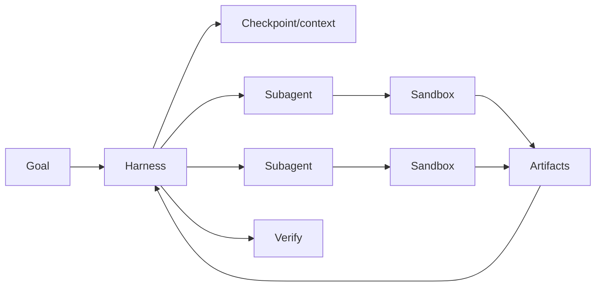

# Long-Running Agent Harness, Sandboxes & Subagent Coordination

## Neden önemli?
Uzun süren agent workload'u tek LLM çağrısı değil; model/tool loop, context, durable progress, execution isolation ve alt-agent koordinasyonu problemidir. OpenAI, 10 Eylül 2026'da public beta Agents API'yi duyurarak Codex harness ve infrastructure'ını managed servis olarak sundu; günler süren işler, dosya/komut çalıştırma ve ara sonuç saklama temel use-case'ler arasındadır.

## Mental model

Harness **control state**, sandbox **execution authority** sınırıdır. Modelin bir eylemi önermesi, o eyleme sınırsız yetki verilmesi anlamına gelmez.

## Temel bileşenler
- **Harness:** model/tool loop, context policy, subagent lifecycle, aggregation.
- **Sandbox:** filesystem/process/network capability isolation.
- **Checkpoint/artifact:** context-window dışındaki durable progress.
- **Tool contract:** schema, timeout, retry ve idempotency semantics.
- **Verification:** completion claim ile output correctness'i ayırır.

## Reliability
Uzun iş crash/restart toleranslı olmalıdır. Non-idempotent side effect'lerde idempotency key/dedup gerekir. Transcript'i durability sanmak pahalı ve kırılgandır; plan, evidence ve intermediate result'lar structured artifact olarak saklanmalıdır. Subagent fan-out yalnız bağımsız work unit'larında güvenlidir; shared-write işlerinde ownership veya merge protocol gerekir.

## Mülakat soruları
1. Harness ile model API çağrısını ayır.
2. Sandbox hangi threat boundary'yi kurar?
3. Context growth nasıl sınırlandırılır?
4. Retry ne zaman duplicate side effect üretir?
5. Checkpoint/resume semantics nasıl tasarlanır?
6. Subagent fan-out latency/cost trade-off'u nedir?
7. Shared workspace conflict nasıl önlenir?
8. Managed vs self-hosted harness nasıl seçilir?

## Seviye beklentisi
- **Mid:** model/tool/harness/sandbox/checkpoint rollerini ayırır.
- **Senior:** retries, idempotency, recovery, context compaction ve verification tasarlar.
- **Staff:** subagent topology, isolation, policy, telemetry ve cost budget kurar.
- **Principal:** build/buy, portability, data boundary ve multi-tenant governance kararı verir.

## Mini alıştırma
İki saatlik repo-migration agent'ı için plan → paralel analiz → edit → test → review DAG'i çiz. Crash sonrası hangi node'dan resume edileceğini ve side-effect idempotency key'lerini belirle.

## Proje
`durable-agent-harness-lab`: intentional crash/resume destekleyen üç aşamalı agent. Task success, resume success, duplicate side effect, tool error, token/tool cost ve p95 duration ölç.

## Failure modes / production
Aşırı geniş sandbox credential/network, kör retry, transcript-only durability, conflicting writes, verification'sız completion ve kontrolsüz fan-out temel risklerdir. Task success, checkpoint age, resume rate, tool retry/error, sandbox violation, verification failure ve cost telemetry izlenmelidir.

## Kaynaklar
- OpenAI — Introducing the Agents API, 10 Eylül 2026: https://openai.com/index/introducing-the-agents-api/
- OpenAI — The next evolution of the Agents SDK, 15 Nisan 2026: https://openai.com/index/the-next-evolution-of-the-agents-sdk/
