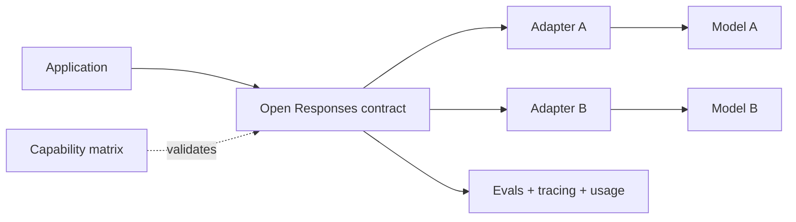

# Open Responses, Provider Interoperability & Agent API Boundaries

## Konu anlatımı
LLM platformunda lock-in yalnız model adından değil request/response state machine, tool-call, streaming, multimodal item, usage ve error semantiğinden gelir. OpenAI 15 Ocak 2026'da Open Responses'ı, Responses API tabanlı açık ve çok sağlayıcılı interoperable LLM interface spesifikasyonu olarak duyurdu.

Ortak wire contract portability'yi artırır; semantic equivalence sağlamaz. Model capability, latency, refusal/safety davranışı, tool semantics, usage accounting ve provider extension'ları farklı kalabilir.

## Mental model

**Invariant:** syntactic interoperability, semantic interchangeability değildir.

## İçeride ne oluyor?
- Contract input/output items, tool invocation, streaming events ve errors için ortak envelope sağlar.
- Adapter unsupported capability, parameter mapping, stop/refusal ve usage farklarını explicit yönetmelidir.
- Streaming reconnect'te partial completion bilinmeli; side-effecting tool calls idempotency/dedup ister.
- Tool argümanının schema-valid olması authorization anlamına gelmez; policy uygulama tarafındadır.
- Lowest-common-denominator portability sağlar ama provider differentiation kaybettirebilir; extensions kontrollü escape hatch'tir.
- Provider migration'ın gerçek compatibility testi offline/online eval'dir: task success, tool accuracy, latency, refusal ve cost regression ölçülür.

## Mülakat soruları
1. LLM interoperability hangi katmanda sağlanabilir?
2. Aynı JSON schema neden model eşdeğerliği sağlamaz?
3. Tool authorization neden provider'a bırakılamaz?
4. Streaming reconnect'te duplicate side effect nasıl engellenir?
5. Staff: capability matrix ve conformance suite nasıl kurulur?
6. Principal: portability ile provider-specific innovation nasıl dengelenir?

## Beklenen cevap seviyesi
- **Mid:** request/response, tool call, streaming ve adapter'ı ayırır.
- **Senior:** retry, partial stream, idempotency, auth ve semantic drift'i tartışır.
- **Staff:** capability negotiation, conformance/eval ve extension governance tasarlar.
- **Principal:** vendor concentration, engineering cost, differentiation, latency ve commercial leverage'i birlikte değerlendirir.

## Mini alıştırma
Text generation, strict tool calling ve image input için iki provider'lı `supported / emulated / unsupported` matrisi çıkar. Strict tool calling zorunluysa routing/fallback policy yaz.

## Proje fikri
`open-responses-router`: ortak request contract, iki adapter, capability registry, timeout/retry budget, tool-call idempotency key ve shadow eval. Task success, p95 latency, cost/request ve fallback rate ölç.

## Failure modes / production
API uyumluluğunu model eşdeğerliği sanmak, unsupported feature'ı sessiz drop etmek, reconnect'te tool'u iki kez çalıştırmak, usage semantics'i eşit varsaymak ve extension'ları kontrolsüz yaymak tipik hatalardır. Capability mismatch, adapter errors, fallback, duplicate suppression, eval success, latency ve usage reconciliation izlenir.

## Kaynaklar
- OpenAI API changelog — Open Responses announcement, 15 Ocak 2026: https://developers.openai.com/api/docs/changelog
- OpenAI — New tools for building agents: https://openai.com/index/new-tools-for-building-agents/
- OpenAI — New tools and features in Responses API: https://openai.com/index/new-tools-and-features-in-the-responses-api/
