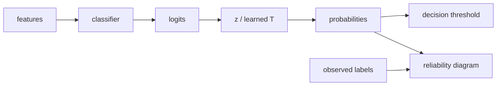

# Probability Calibration, Reliability Diagrams & Temperature Scaling

## Konu anlatımı
Classification accuracy ile probability quality aynı şey değildir. Calibrated model `p=0.8` dediği örneklerde uzun vadede yaklaşık %80 empirical success görmelidir. Ranking/discrimination iyi olduğu halde confidence sistematik olarak overconfident veya underconfident olabilir.

Reliability diagram probability bin'lerinde mean predicted probability ile observed frequency'yi karşılaştırır. ECE pratik bir özet olsa da binning seçimine duyarlıdır; Brier score ve log-loss gibi proper scoring rule'larla birlikte okunmalıdır.

Temperature scaling validation/calibration set üzerinde tek scalar `T` öğrenir ve logits'i `z/T` olarak ölçekler. Argmax ordering'i korurken confidence sharpness'ını ayarlayabilir. Calibration data training'den ayrılmalı; drift ve class-prior/segment değişimi production calibration'ı bozabileceği için yeniden ölçülmelidir.

## Mental model

## İçeride ne oluyor?
- Calibration discrimination değildir; AUROC iyi iken probabilities kötü olabilir.
- Reliability diagram local miscalibration gösterir; bin sample counts önemlidir.
- ECE binning-dependent'tir; tek başına yeterli değildir.
- Temperature scaling tek parametreli post-hoc calibration'dır; basittir fakat class/group-specific hataları düzeltemeyebilir.
- Calibration set model-fitting data'dan ayrılmalıdır.
- Threshold optimization FP/FN business cost problemidir; calibration ile aynı değildir.
- Drift ve cohort shift global calibration metriğini yanıltabilir.

## Mülakat soruları
1. Accuracy yüksekken calibration neden kötü olabilir?
2. Reliability diagram nasıl okunur?
3. ECE'nin zayıflığı nedir?
4. Temperature scaling argmax'i neden genellikle değiştirmez?
5. Calibration set leakage'i nasıl önlersin?
6. Calibration ile threshold optimization farkı nedir?
7. Staff: cohort-level calibration monitoring ve recalibration trigger'ını nasıl tasarlarsın?

## Beklenen cevap seviyesi
- **Junior:** predicted confidence ile empirical correctness ilişkisini açıklar.
- **Mid:** reliability diagram, Brier/log-loss ve temperature scaling'i bağlar.
- **Senior:** leakage, drift, imbalance ve threshold economics'i tartışır.
- **Staff:** cohort monitoring, recalibration ve downstream decision riskini tasarlar.

## Mini alıştırma
0.9–1.0 confidence bin'inde 200 örneğin yalnız 150'si doğruysa observed accuracy=0.75'tir; model bu bin'de overconfident'tır. Bunun automated decision threshold'a etkisini tartış.

## Proje fikri
`calibration-lab`: classifier eğit, held-out set üzerinde reliability diagram, log-loss, Brier ve ECE ölç. Temperature scaling uygula; accuracy/AUROC ile calibration metriklerinin değişimini karşılaştır. Synthetic prior shift ile drift etkisini ekle.

## Failure modes / trade-off / production
Training data üzerinde calibration fit etmek leakage'dir. Yalnız ECE binning artefact'larını gizleyebilir. Global calibration azınlık cohort'taki hatayı maskeleyebilir. Production'da log-loss/Brier, reliability curve, cohort gap, confidence distribution, class prior, abstention rate ve business-cost metriği birlikte izlenmelidir.

## Kaynaklar
- Guo et al., ICML 2017: https://proceedings.mlr.press/v70/guo17a.html
- scikit-learn Probability calibration: https://scikit-learn.org/stable/modules/calibration.html
- scikit-learn CalibratedClassifierCV: https://scikit-learn.org/stable/modules/generated/sklearn.calibration.CalibratedClassifierCV.html
