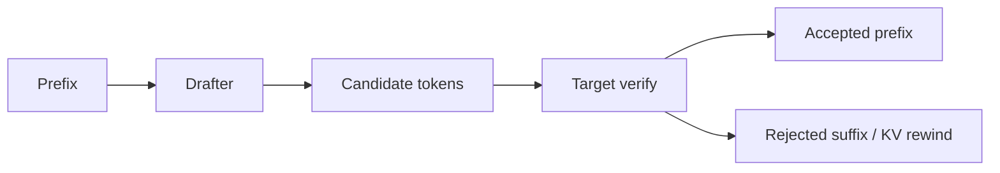

# Speculative Decoding, Acceptance Rate & Serving Economics

## Amaç
Speculative decoding, autoregressive LLM inference'ın seri target-model kritik yolunu ucuz tahmin + toplu doğrulama ile kısaltmaya çalışır. Drafter birkaç token önerir; target model adayları tek forward pass'te doğrular ve yalnız uyumlu prefix kabul edilir.

## Temel trade-off
Başarı metriği yalnız acceptance rate değildir. TTFT, inter-token latency, tokens/s, GPU utilization, KV-cache occupancy ve cost/token birlikte değerlendirilmelidir. Düşük batch'te target GPU under-utilized olduğunda speculation güçlü olabilir; yüksek concurrency'de drafter overhead ve scheduling karmaşıklığı throughput'u düşürebilir.

Draft length büyüdükçe potansiyel accepted token sayısı artar; yanlış tahminlerde wasted compute da büyür. Draft/target tokenizer uyumu kritiktir. Rejected tokenların KV-cache allocation'ı güvenli biçimde geri sarılmalıdır.

## Mülakat katmanları
- **Mid:** draft → verify → accept/reject mekanizması.
- **Senior:** acceptance, batching, KV cache ve tail latency.
- **Staff:** request-class bazlı adaptive speculation ve benchmark tasarımı.
- **Principal:** latency SLO, fleet utilization, cost/token ve rollout ekonomisi.

Sorular: Speculation correctness'i neden bozmaz? Draft zayıfsa ne olur? Continuous batching ile etkileşim nedir? Hangi request sınıfında kapatılır? KV rewind bug'ı nasıl gözlenir?

## Alıştırma ve proje
`draft_len={1,2,4,8}` ile acceptance oranlarını sweep ederek göreli target-pass ve cost/token modeli çıkar. Ardından baseline/speculative serving'i concurrency bucket'larında benchmark eden `spec-decode-bench` kur; TTFT, ITL, throughput, acceptance, GPU utilization ve KV occupancy ölç.

## Failure modes / production
Tokenizer mismatch, düşük acceptance, aşırı draft length, yüksek batch'te regression, KV leak/corruption ve tek global config başlıca risklerdir. Canary rollout, workload segmentation ve anında baseline'a dönüş yolu gerekir.

## Kaynaklar
- NVIDIA TensorRT-LLM — Speculative Decoding: https://nvidia.github.io/TensorRT-LLM/features/speculative-decoding.html
- vLLM — Speculative Decoding: https://docs.vllm.ai/en/latest/features/spec_decode.html