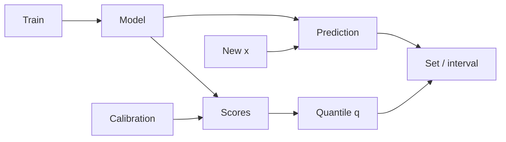

# Conformal Prediction, Coverage Guarantees & Distribution Shift

## Konu anlatımı
Conformal prediction, mevcut modelin calibration örneklerindeki hata/nonconformity skorlarını kullanarak prediction set veya interval üretir. Split conformal uygun exchangeability altında model-agnostic finite-sample marginal coverage sağlar. Bu, her segment veya her `x` için conditional coverage garantisi değildir.

## Mental model
Point estimate “ne bekliyorum?” der; conformal set “kalibrasyon verisi ve varsayımlarım altında ne kadar geniş bir güvenli bölge ayırmalıyım?” sorusuna cevap verir. Coverage ve efficiency birlikte düşünülür.

## İçeride ne oluyor?
Regression'da score `|y-ŷ|` seçilebilir ve calibration quantile ile `[ŷ-q, ŷ+q]` interval'i kurulur. Classification'da score'a göre label set oluşur. Calibration verisinin train'den ayrılması önemlidir. Distribution shift exchangeability'yi bozabilir; temporal/segment bazlı realized coverage bu yüzden production telemetry'sidir.

## Mülakat soruları
1. Calibration ile conformal prediction farkı nedir?
2. %90 marginal coverage neyi garanti etmez?
3. Calibration set neden ayrıdır?
4. Çok geniş interval doğru ama faydasız olabilir mi?
5. Senior: drift coverage'da nasıl görünür?
6. Staff: segment undercoverage ile sample noise nasıl ayrılır?
7. Staff: set size'ı abstention/escalation policy'ye nasıl bağlarsın?

## Seviyeye göre cevap derinliği
- **Junior:** point prediction vs interval/set.
- **Mid:** nonconformity score, quantile, marginal coverage.
- **Senior:** exchangeability, shift, conditional undercoverage, efficiency.
- **Staff:** monitoring, recalibration, segmentation, downstream decision policy.

## Mini alıştırma
20 calibration residual'ı ile `α=0.1` split-conformal threshold hesapla; test residual scale'ini 2x yapıp empirical coverage değişimini ölç.

## Proje fikri
`conformal-monitor`: regression wrapper + global/segment coverage, interval width, drift ve abstention dashboard'u; farklı calibration-window'ları backtest et.

## Failure modes / trade-off / production
Leakage, küçük calibration sample, temporal shift, subgroup undercoverage, aşırı geniş interval, delayed labels ve marginal guarantee'nin “%90 confidence” diye yanlış sunulması. Production'da label-delay-aware realized coverage, width/set size, segment sample count ve recalibration/rollback policy izlenmelidir.

## Kaynaklar
- Barber, Candès, Ramdas, Tibshirani — Conformal Prediction Beyond Exchangeability: https://arxiv.org/abs/2202.13415
- Zhou et al., 28 Mar 2026 — Conformal Prediction Assessment: https://arxiv.org/abs/2603.27189
