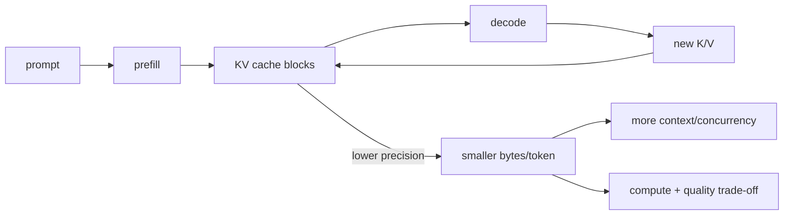

# KV-Cache Quantization, Context Capacity & Serving Economics

## Konu anlatımı
Autoregressive decode geçmiş token'ların attention key/value state'ini yeniden hesaplamak yerine KV cache'den okur. Bu compute tasarrufu request-dependent GPU memory maliyeti yaratır: context, concurrency, layer sayısı, KV-head sayısı ve head dimension arttıkça cache büyür. Uzun-context serving'de capacity bottleneck model weights'ten KV cache'e kayabilir.

KV-cache quantization K/V state'ini FP16/BF16 yerine FP8/INT8/INT4 gibi daha düşük precision formatlarda tutarak token başına byte'ı azaltmayı hedefler. Açılan headroom daha fazla resident token, concurrency veya context sağlayabilir. Bedeli quantize/dequantize işi, scale metadata, kernel/backend constraints ve quality riskidir.

## Mental model

## İçeride ne oluyor?
- Prefill prompt'u işler; decode geçmiş K/V state'ini tekrar kullanır.
- Paged/block allocation variable-length requests ve fragmentation yönetimini kolaylaştırabilir.
- Scale granularity numeric accuracy ile metadata/kernel overhead arasında trade-off yaratır.
- vLLM güncel dokümantasyonu FP8 KV cache için per-tensor ve per-attention-head scaling seçeneklerini belgeliyor.
- Weight quantization static parameters'ı; KV-cache quantization runtime request state'ini küçültür.
- Memory footprint azalması throughput'un aynı oranda artacağını garanti etmez; workload compute/kernel bound olabilir.
- Quality model ve task'a bağlıdır; serving benchmark ile task-level eval birlikte gerekir.

## Mülakat soruları
1. KV cache neden vardır?
2. Context length serving memory'yi neden büyütür?
3. Weight ve KV-cache quantization farkı nedir?
4. FP8 KV cache hangi capacity avantajını hedefler?
5. Prefill ve decode resource profilleri neden farklıdır?
6. Senior: block size/fragmentation trade-off'u nedir?
7. Staff: TTFT, ITL, throughput ve quality ile rollout'u nasıl değerlendirirsin?
8. Principal: GPU eklemek ile agresif quantization arasında $/token ve risk kararı nasıl verilir?

## Beklenen cevap derinliği
- **Mid:** attention state, prefill/decode, KV cache ve context-memory ilişkisi.
- **Senior:** paged allocation, precision/scales, latency-throughput-quality.
- **Staff:** workload histogramı, GPU budget, canary ve regression gates.
- **Principal:** $/token, headroom, hardware portability ve quality-risk budget.

## Mini alıştırma
KV cache için 24 GiB kaldığını ve FP16 cache'in token başına 512 KiB kullandığını varsay. Resident token capacity'yi hesapla. Cache byte'ı yarıya inince teorik capacity'yi yeniden hesapla ve throughput'un neden zorunlu olarak iki kat olmadığını açıkla.

## Proje
`kv-capacity-lab`: aynı model/workload için BF16 ve FP8 KV cache varyantlarını karşılaştır. Context histogramı, concurrent sequences, GPU memory, TTFT, inter-token latency, tokens/s ve task-level quality kaydet.

## Failure modes / trade-off / production
"Memory yarıya indi = throughput iki kat" varsayımı; yalnız short-context benchmark; scale/calibration etkisini atlamak; backend/hardware desteğini varsaymak; quality'yi tek metrikle değerlendirmek tipik hatalardır. Production'da cache occupancy, eviction/preemption, OOM, TTFT, ITL, tokens/s, context distribution ve task quality birlikte izlenir.

## Kaynaklar
- vLLM — Quantized KV Cache: https://docs.vllm.ai/en/latest/features/quantization/quantized_kvcache/
- vLLM — CacheConfig: https://docs.vllm.ai/en/latest/api/vllm/config/cache/
- vLLM — Quantization: https://docs.vllm.ai/en/latest/features/quantization/
- PyTorch torchao — quantization: https://docs.pytorch.org/ao/stable/api_reference/api_ref_quantization.html
