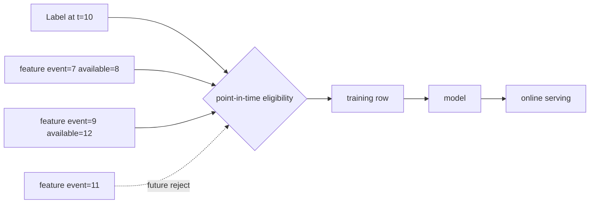

# Point-in-Time Correct Feature Joins, Leakage & Training-Serving Skew

## Neden önemli?
ML training dataset'i normal latest-value join değildir. Label `t` anında oluştuysa model yalnız o anda erişilebilir feature'ları kullanmalıdır. Gelecekteki bilgi geçmiş label'a bağlanırsa offline evaluation yapay olarak iyileşir ve production'da tekrarlanamaz.

## Mental model

**Invariant:** training row yalnız prediction anında bilinebilecek bilgiyi içermelidir.

## Point-in-time correctness
Her entity/label satırı için `feature_event_time <= label_time` koşulunu sağlayan en yeni feature seçilir ve gerekiyorsa TTL/freshness sınırı uygulanır. Feast historical retrieval, entity timestamp'inden geriye doğru tarayarak TTL içindeki feature değerini seçer.

Event time tek başına her zaman yeterli değildir. Late-arriving data geçmiş event time taşıyıp sisteme label'dan sonra ulaşabilir. Backfill bugün bilinen bu değeri geçmişte biliniyormuş gibi kullanırsa leakage oluşur. Bu nedenle kritik sistemlerde `event_time`, `created/ingestion/availability_time`, dataset snapshot ve feature version provenance birlikte düşünülmelidir.

## Training-serving skew
Offline training ile online serving farklı transform, default/null policy veya feature version kullanırsa aynı entity için farklı değerler üretilebilir. Feature definition, transform semantics, freshness ve materialization contract'ı ortak olmalıdır.

## Mülakat soruları
1. Feature leakage nedir?
2. Point-in-time join latest-value join'den nasıl ayrılır?
3. Event time ve ingestion time neden farklıdır?
4. TTL correctness'i nasıl etkiler?
5. Late data backfill'de nasıl ele alınır?
6. Offline-online skew nasıl ölçülür?
7. Staff/Principal seviyesinde feature lineage ve versioning nasıl yönetilir?

## Seviyeye göre cevap
- **Mid:** leakage, entity key, timestamp ve as-of join.
- **Senior:** late data, TTL, null/default ve offline-online parity.
- **Staff/Principal:** snapshot provenance, feature versioning, data contracts, skew SLO ve governance.

## Mini alıştırma
`orders(user_id, label_time, fraud)` ve `user_stats(user_id, event_time, created_time, chargebacks_30d)` için leakage-safe pseudo-SQL yaz. `created_time > label_time` late row'ları için iki policy ve trade-off belirt.

## Proje
`pit-join-auditor`: event-time/availability-time ihlali, TTL breach, duplicate timestamp, lineage ve offline-online mismatch raporu üreten DuckDB/Spark aracı.

## Failure modes / trade-off / production
Bugünkü latest feature'ı geçmiş label'a join etmek, availability time'ı yok saymak, backfill'i geçmiş production state'i sanmak, offline/online transform'u ayrı kodlamak ve null semantics'i versionlamamak temel hatalardır. İzlenecek sinyaller: feature freshness, null rate, offline-online mismatch, late-arrival distribution, materialization lag ve model metric drift.

## Kaynaklar
- Feast — Point-in-time joins: https://docs.feast.dev/getting-started/concepts/point-in-time-joins
- Feast — Feature retrieval: https://docs.feast.dev/getting-started/concepts/feature-retrieval
- Feast — Concepts: https://docs.feast.dev/getting-started/concepts
