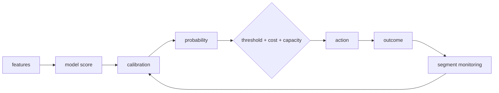

# Probability Calibration, Decision Thresholds & Cost-Sensitive Serving

## Mental model
**Model sıralar → calibrator olasılık diline çevirir → policy iş kararını verir.** AUC, probability quality ve business decision aynı problem değildir.

## Calibration nedir?
Bir modelin 0.8 dediği örneklerin uzun vadede yaklaşık %80'i pozitif oluyorsa o bölgede iyi calibrated olduğu söylenebilir. Reliability diagram predicted-probability bin'lerini empirical positive frequency ile karşılaştırır. İdeal eğri yaklaşık diagonaldir.

Ranking metriği yüksek olup probability calibration kötü olabilir. Bu ayrım özellikle risk, capacity allocation ve expected-cost hesaplarında önemlidir.

## Brier, log loss ve reliability
Brier score ve log loss probabilistic prediction için proper scoring rules'dur. Ancak Brier tek başına yalnız calibration'ı ölçmez; reliability yanında resolution/discrimination ve data uncertainty etkileri vardır. Bu nedenle reliability diagram ve segment breakdown ile birlikte yorumlanmalıdır.

## Calibration yöntemleri
- **Sigmoid/Platt:** kısıtlı parametrik mapping; daha az esnek.
- **Isotonic:** monotonic non-parametric mapping; daha esnek, az calibration data'sında overfit riski daha yüksek.
- Calibration fit verisi base-model training verisinden ayrılmalıdır; cross-validation veya held-out calibration set kullanılır.

## Threshold bir business policy'dir
`0.5` evrensel threshold değildir. False-positive/false-negative cost, manual-review capacity, SLA, risk appetite ve downstream action maliyeti threshold'u belirleyebilir. Model/calibrator ve policy ayrı versionlanırsa model değişmeden business policy güncellenebilir.

Basit cost modeli:

`ExpectedCost(t) = FP(t) * C_FP + FN(t) * C_FN + Review(t) * C_review`

Capacity constraint varsa `Review(t) <= daily_capacity` gibi ek koşul gerekir.

## Drift ve monitoring
Class prevalence veya conditional distribution değişince calibration bozulabilir. Global reliability iyi görünürken kritik country/device/customer segmenti kötü olabilir. Delayed labels varsa calibration monitoring penceresi outcome arrival semantics'ine göre tasarlanmalıdır.

## Mülakat soruları
1. Calibration ile AUC/accuracy farkı nedir?
2. Reliability diagram nasıl okunur?
3. Threshold neden 0.5 olmak zorunda değildir?
4. Sigmoid vs isotonic trade-off'u nedir?
5. Calibration leakage nasıl oluşur?
6. Prevalence shift calibration'ı nasıl etkiler?
7. Sabit fraud-review capacity altında policy nasıl tasarlanır?
8. Global calibration neden segment riskini gizleyebilir?

## Beklenen cevap seviyesi
- **Mid:** score/probability ayrımı, reliability diagram, threshold.
- **Senior:** held-out calibration, proper scoring, prevalence/segment drift.
- **Staff/Principal:** cost/capacity policy, versioning, delayed labels, recalibration cadence ve governance.

## Mini alıştırma
`probability,label,segment` tablosundan 10-bin reliability table üret. Segment bazında sapmaları karşılaştır. `C_FP=1`, `C_FN=8` için 0.1–0.9 threshold sweep ile expected cost hesapla; review capacity ekleyince optimum'un nasıl değiştiğini incele.

## Proje fikri
`calibration-gate`: sklearn classifier + held-out sigmoid/isotonic calibration. Reliability diagram, Brier/log-loss, threshold-cost curve ve segment gate üret. Calibrator ile decision-policy config'ini ayrı versionla.

## Failure modes / production bağlantısı
Training data üzerinde calibrator fit etmek, yalnız AUC izlemek, threshold'u model binary'sine gömmek, prevalence drift'i yok saymak ve global metric ile küçük risk segmentlerini maskelemek tipik failure mode'lardır.

## Kaynaklar
- scikit-learn — Probability calibration: https://scikit-learn.org/stable/modules/calibration.html
- CalibrationDisplay: https://scikit-learn.org/stable/modules/generated/sklearn.calibration.CalibrationDisplay.html
- Brier score loss: https://scikit-learn.org/stable/modules/generated/sklearn.metrics.brier_score_loss.html
