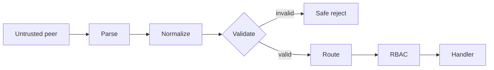

# gRPC/xDS Protocol Validation, Canonicalization & Fail-Safe Policy

## Neden önemli?
RPC ingress metadata'sı routing, authorization ve availability için trust boundary'dir. Parser'ın bir frame'i kabul etmesi application invariant'larının sağlandığı anlamına gelmez. Wire input önce parse, sonra canonicalize, sonra validate edilmeli; ancak bundan sonra route/policy evaluation yapılmalıdır.

## Mental model

## Güncel vaka
15 Eylül 2026 tarihli Go vulnerability kayıtları iki failure class gösterir. GO-2026-6443'te gRPC-Go xDS server, hem `:authority` hem `Host` eksik olduğunda panic ederek availability kaybedebilir. GO-2026-6441'de RBAC header matcher isimlerinin lowercase canonicalize edilmemesi mixed-case header ile policy bypass/fail-open davranışına yol açabilir.

## Mülakat ekseni
Mid seviyede malformed input'un error'a çevrilmesi ve canonicalization; Senior seviyede fail-open/fail-closed, fuzzing ve protocol invariants; Staff seviyede proxy/backend semantic consistency ve trust-boundary ownership; Principal/CTO seviyesinde dependency patch SLA, exposure inventory ve fleet rollout beklenir.

## Production checklist
- invalid metadata'yı explicit reject et; panic etme
- canonicalization'ı policy evaluation'dan önce tek yerde tanımla
- missing/duplicate/mixed-case/oversized metadata için negative tests ekle
- property/fuzz tests ile process-liveness invariant'ı kur
- invalid-metadata, auth decision, panic/restart ve version coverage telemetry'si tut
- dependency fix'lerini staged rollout ve rollback ile dağıt

## Failure modes / trade-off
Strict validation eski veya non-conformant client'ları kırabilir; permissive ambiguity ise security boundary'yi zayıflatır. Compatibility migration gerekiyorsa ambiguity'yi observable warning → explicit deadline → reject sırasıyla kapatmak, sessiz fail-open'dan daha güvenlidir.

## Kaynaklar
- https://pkg.go.dev/vuln/GO-2026-6443
- https://pkg.go.dev/vuln/GO-2026-6441
- https://github.com/grpc/grpc-go
- https://www.rfc-editor.org/rfc/rfc9113
