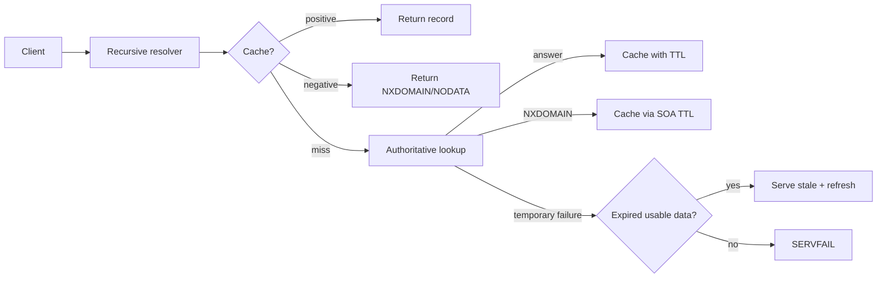

# DNS Negative Caching, NXDOMAIN & Serve-Stale Resilience

## Neden önemli?
DNS cache yalnız mevcut kayıtları değil, yokluk bilgisini de tutar. RFC 2308'de NXDOMAIN ismin bulunmadığını; NODATA ise isim var olduğu halde istenen RR type'ın bulunmadığını belirtir. Negative caching upstream yükünü azaltır ama yeni record rollout'larında propagation sürprizleri yaratabilir.

## Mental model

## İçeride ne oluyor?
Authoritative server negatif cevapta SOA taşır. RFC 2308'e göre negative TTL, SOA.MINIMUM ile SOA TTL'in küçüğünden türetilir. Daha önce cache'lenmiş NXDOMAIN, yeni positive record yayınlandıktan sonra TTL bitene kadar bazı resolver'larda etkisini sürdürebilir.

RFC 8767 serve-stale, authoritative kaynak geçici erişilemezken expired data'yı kontrollü biçimde sunarak availability'yi artırır. Resolver stale cevap verdikten sonra refresh denemesini sürdürmelidir. TTL=0 data cache'lenmediğinden stale fallback için de kullanılamaz.

## Mülakat soruları
1. NXDOMAIN ve NODATA farkı nedir?
2. Negative caching neden vardır?
3. Negative TTL nereden gelir?
4. Yeni DNS kaydı neden hemen görünmeyebilir?
5. DNS cutover öncesi negative-cache riski nasıl azaltılır?
6. Serve-stale hangi outage'larda faydalıdır?
7. Freshness/availability policy nasıl belirlenir?

## Beklenen cevap seviyesi
- **Junior:** resolver, authoritative server, TTL, NXDOMAIN.
- **Mid/Senior:** SOA, NODATA, negative TTL, propagation.
- **Staff:** serve-stale, refresh timeout, failure isolation ve resolver policy.
- **Principal:** multi-region resilience, control-plane dependency ve freshness budget.

## Mini alıştırma
Negative TTL 30 dakika olan yeni bir isim, deploy'dan 10 dakika önce yanlışlıkla sorgulanıp NXDOMAIN cache'leniyor. Etki zaman çizelgesini ve daha güvenli rollout prosedürünü çıkar.

## Proje fikri
`dns-rollout-lab`: authoritative ve recursive resolver container'larıyla NXDOMAIN cache, record creation, TTL expiry ve serve-stale outage senaryolarını tekrar üret.

## Failure modes / trade-off
Yalnız positive TTL'e bakmak, NXDOMAIN ile SERVFAIL'i aynı saymak, TTL=0'ı stale kullanılabilir sanmak ve stale data'yı sınırsız sunmak yaygın hatalardır. Uzun negative TTL yükü azaltır ama yeni isimlerin görünürlüğünü geciktirir; serve-stale availability'yi artırırken eski endpoint'e trafik gönderme riskini taşır.

## Production bağlantısı
NXDOMAIN/NODATA/SERVFAIL oranları, recursive latency, cache hit ratio, stale-answer count, authoritative reachability ve rollout propagation izlenmelidir.

## Kaynaklar
- RFC 2308 — DNS Negative Caching: https://datatracker.ietf.org/doc/html/rfc2308
- RFC 8767 — Serving Stale Data: https://datatracker.ietf.org/doc/html/rfc8767
