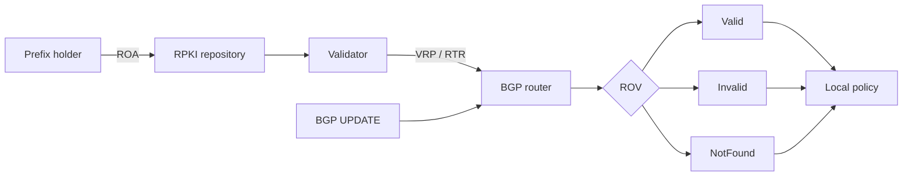

# BGP RPKI, Route Origin Validation & Route-Leak Boundaries

## Konu anlatımı
BGP ilanı tek başına bir AS'nin prefix'i originate etmeye yetkili olduğunu kriptografik olarak kanıtlamaz. RPKI'de prefix sahibi **Route Origin Authorization (ROA)** ile origin ASN ve izin verilen `maxLength` değerini imzalı olarak yayınlar. Relying-party validator repository nesnelerini doğrular ve router'a Validated ROA Payload (VRP) cache sağlar.

RFC 6811'e göre route üç durumda sınıflanır: **Valid** — en az bir VRP prefix'i cover eder ve ASN/prefix-length eşleşir; **Invalid** — VRP cover eder ama origin veya `maxLength` uyuşmaz; **NotFound** — route'u cover eden VRP yoktur. Bu state routing policy'ye girdidir; policy'nin kendisi değildir.

En önemli sınır: ROV yalnız **origin** yetkisini doğrular. Doğru origin'li bir route yanlış peer'a/yanlış kapsamda propagate edilirse route leak oluşabilir. Bu yüzden 'RPKI var, BGP güvenli' sonucu yanlıştır. Mart 2026 tarihli IETF `8210bis-25` taslağı RPKI-Router v2'de origin verisinin yanında Router Keys ve ASPA verisini de cache-router hattına taşımayı tarif eder; draft status'ü production standardı ile karıştırılmamalıdır.

## Mental model

**Invariant:** Origin-valid olmak AS_PATH'in veya propagation policy'sinin doğru olduğunu kanıtlamaz.

## İçeride ne oluyor?
ROA, prefix + origin ASN + maximum prefix length bildirir. Validator imzalı RPKI object graph'ini kontrol edip VRP üretir. Router bu cache'i RPKI-Router protocol ile alır ve BGP UPDATE'teki route prefix/origin'i VRP'lerle karşılaştırır. Cryptographic validation router data plane'inde yapılmaz. Çoklu validator failure-domain'i azaltır; cache freshness ve local overrides operasyonel policy'nin parçasıdır.

## Mülakat soruları
1. Hijack ve route leak farkı nedir?
2. `maxLength` neyi sınırlar?
3. Valid/Invalid/NotFound nasıl hesaplanır?
4. Validator neden router'dan ayrıdır?
5. Validator outage'ında fail-open/fail-closed trade-off'u nedir?
6. ROV neden path leak'i tek başına çözmez?
7. Invalid-drop enforcement'ı fleet'te nasıl rollout edersin?
8. ROV, ASPA/path validation ve peer policy nasıl katmanlanır?

## Beklenen cevap seviyesi
- **Mid:** ASN, prefix, ROA/VRP ve validation state'leri.
- **Senior:** `maxLength`, stale cache, redundancy ve local policy.
- **Staff:** staged enforcement, exceptions, telemetry ve blast radius.
- **Principal:** origin/path/relationship güvenlik sınırları ve interconnect governance.

## Mini alıştırma
`203.0.113.0/24, AS64500, maxLength=/24` VRP'si için `/24 AS64500`, `/25 AS64500`, `/24 AS64501` ve farklı bir `/24` ilanını sınıflandır. Sonra `/25` izni vermenin güvenlik trade-off'unu açıkla.

## Proje fikri
`rov-lab`: VRP + announcement input'undan Valid/Invalid/NotFound çıkaran CLI; stale cache, validator outage ve `maxLength` testleri ekle.

## Failure modes / trade-off / production
Yanlış ROA meşru route'u Invalid yapabilir; geniş `maxLength` attack surface'i artırır; tek validator failure domain yaratır; validator outage'ında agresif fail-closed reachability kaybı doğurabilir. Yalnız ROV kullanmak route leak riskini çözmez. Validation-state oranları, newly-invalid prefixes, validator freshness/session health, RTR lag, overrides, BGP churn ve reachability SLO birlikte izlenmelidir.

## Kaynaklar
- RFC 6811: https://www.rfc-editor.org/rfc/rfc6811.html
- RFC 8893: https://www.rfc-editor.org/rfc/rfc8893.html
- RPKI Using Data: https://rpki.readthedocs.io/en/latest/rpki/using-rpki-data.html
- IETF 8210bis-25, 2 Mar 2026: https://datatracker.ietf.org/doc/html/draft-ietf-sidrops-8210bis-25
