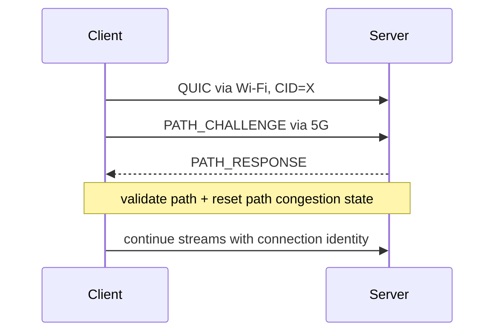

# QUIC Connection Migration, HTTP/3 & 0-RTT Replay Boundaries

## Neden önemli?
HTTP/3, HTTP semantics'i QUIC üzerinde taşır. QUIC UDP üzerinde reliable streams, congestion control ve TLS 1.3 entegrasyonu sağlar. Connection ID bağlantı kimliğini IP/port adresinden ayırdığı için istemcinin Wi-Fi→5G gibi path değişimlerinde bağlantı yaşayabilir.

RFC 9000'a göre aktif migration handshake confirmation öncesinde başlatılmaz. Yeni path `PATH_CHALLENGE/PATH_RESPONSE` ile validate edilir. Yeni path'in RTT ve kapasitesi farklı olabileceği için congestion controller ve RTT tahmini migration sırasında yeniden ele alınır.

TLS resumption tabanlı 0-RTT latency'yi azaltabilir fakat replay-safe değildir. RFC 9001, 0-RTT application data'nın replay edilebileceğini belirtir; non-idempotent side effect'lerde 0-RTT kapatılmalı veya application-level replay/idempotency koruması uygulanmalıdır.

## Mental model

## Mülakat soruları
1. HTTP/2/TCP ile HTTP/3/QUIC head-of-line davranışı nasıl farklıdır?
2. Connection ID migration'ı nasıl mümkün kılar?
3. Path validation neden gerekir?
4. Migration sonrası congestion state neden aynen taşınmaz?
5. 0-RTT replay riski nedir?
6. GET ve payment POST için 0-RTT policy neden farklı olabilir?
7. Load balancer CID routing'i nasıl etkiler?

## Failure modes / trade-off
UDP blocking, NAT rebinding, CID routing hatası, path validation failure, eski congestion state'i taşıma, 0-RTT replay ve non-idempotent side effect tipiktir. QUIC latency/mobility avantajı verir; fakat edge/LB observability ve UDP fallback operasyonunu karmaşıklaştırabilir.

## Production telemetry
Handshake RTT, H3 adoption/fallback, migration count, path validation success, loss/RTT before-after, 0-RTT accept/reject ve replay suppression izlenir.

## Kaynaklar
- RFC 9000 — QUIC Transport: https://www.rfc-editor.org/rfc/rfc9000.html
- RFC 9001 — TLS for QUIC: https://www.rfc-editor.org/rfc/rfc9001.html
- RFC 9114 — HTTP/3: https://www.rfc-editor.org/rfc/rfc9114.html
