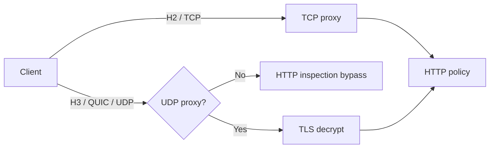

# HTTP/3 Inspection: QUIC/UDP & Policy Enforcement

## Konu anlatımı
HTTP/3, HTTP semantiğini QUIC üzerinde taşır; QUIC TCP yerine UDP kullanır ve TLS 1.3'ü protokole entegre eder. TCP/TLS odaklı secure web gateway mimarilerinde bu farklı transport path görünürlük boşluğu yaratabilir. Cloudflare'ın 22 Nisan 2026 tarihli resmi dokümanı, HTTP/3 inspection için UDP proxy'nin; HTTPS içeriği için de TLS decryption'ın etkinleştirilmesi gerektiğini belirtir.

## Mental model

## Internals ve trade-off
- HTTP/3 QUIC/UDP kullandığı için klasik TCP intercept path otomatik olarak H3'ü kapsamaz.
- Network policy UDP flow'u görebilir; URL/header gibi HTTP semantiği application-layer inspection gerektirir.
- TLS decryption certificate trust, privacy, compliance ve key-handling sorumluluğu getirir.
- H3 engellenince client H2'ye fallback edebilir; policy parity iki protokolde de test edilmelidir.
- QUIC connection migration ve multiplexing, TCP connection mental modelinin birebir uygulanmasını riskli kılar.

## Mülakat soruları
1. HTTP/3 neden TCP proxy'den geçmeyebilir?
2. Network policy ile HTTP policy visibility farkı nedir?
3. TLS decryption'ın security/privacy trade-off'ları nelerdir?
4. Senior: H3→H2 fallback'ını nasıl test edersin?
5. Staff: mixed H2/H3 fleet'te policy parity nasıl kanıtlanır?
6. Principal: encrypted transport evolution karşısında endpoint ve network controls nasıl dengelenir?

## Seviye beklentisi
- **Mid:** TCP/UDP, QUIC, TLS 1.3 ve HTTP/3 katmanları.
- **Senior:** proxy path, fallback, trust ve bypass.
- **Staff:** protocol coverage, rollout, telemetry ve parity tests.
- **Principal:** privacy/regulatory boundary ve encrypted-traffic strategy.

## Alıştırma
Trafiğin %35'i H3/UDP, %65'i H2/TCP ve DLP yalnız TCP proxy path'te çalışıyorsa teorik HTTP inspection coverage'ı hesapla. UDP proxy açılınca latency/failure surface'in neden büyüyebileceğini tartış.

## Proje
`h3-policy-lab`: H2/H3 endpoint kur; UDP allowed/blocked/proxied varyantlarında negotiation, fallback, latency ve policy logs karşılaştır. Aynı URL policy'si için H2/H3 parity testini otomatikleştir.

## Production failure modes
`443 = TCP` varsayımı, firewall policy'yi application inspection sanmak, TLS decryption privacy etkisini modellememek ve fallback/capacity testlerini atlamak tipik hatalardır. H3 adoption, UDP proxy errors, fallback rate, handshake latency, policy parity, decrypt failures ve bypass indicators izlenmelidir.

## Kaynaklar
- https://developers.cloudflare.com/cloudflare-one/traffic-policies/http-policies/http3/
- https://www.rfc-editor.org/rfc/rfc9114
- https://www.rfc-editor.org/rfc/rfc9000
