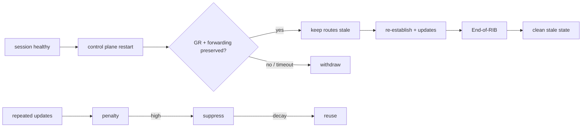

# BGP Graceful Restart, Stale Routes & Route-Flap Damping

## Konu anlatımı
BGP control-plane restart normalde session reset, route churn ve transient blackhole/loop üretebilir. RFC 4724 Graceful Restart (GR), forwarding state korunabiliyorsa helper peer'in route'ları geçici olarak **stale** tutmasına izin verir. Session geri kurulur, yeni updates gelir ve End-of-RIB initial update'in tamamlandığını işaretler. Restart timer stale state için üst sınırdır.

GR availability kazanımı sağlar fakat stale route gerçekten geçersizse failure'ı uzatabilir. Control-plane liveness ile data-plane viability ayrı sinyallerdir; BFD/L2 health ve FIB reachability bu yüzden önemlidir.

Route-Flap Damping (RFD) farklıdır: sık update alan prefix'e penalty biriktirir, suppress threshold aşılınca route'u geçici bastırır, penalty decay edince reuse eder. Agresif damping path hunting nedeniyle meşru reachability'yi gereksiz yere bastırabilir.

## Mental model

## İçeride ne oluyor?
- GR capability OPEN sırasında address-family bazında negotiate edilir.
- Helper session kaybında uygun routes'u stale tutabilir; restart time dolarsa temizlemelidir.
- End-of-RIB initial update completion sinyalidir.
- Forwarding state korunmadıysa stale route blackhole yaratabilir.
- RFD penalty/decay/suppress/reuse state machine'idir; GR ile aynı problem değildir.
- RFD threshold/half-life yanlışsa convergence ve reachability zarar görebilir.

## Mülakat soruları
1. Graceful Restart hangi problemi çözer?
2. Stale route neden geçici tutulur?
3. End-of-RIB ne işe yarar?
4. GR hangi durumda outage'ı uzatabilir?
5. BFD ile GR nasıl birlikte düşünülür?
6. Route-Flap Damping neden güvenli bir universal default değildir?
7. Staff: multi-vendor backbone'da GR timer/policy standardını nasıl rollout edersin?

## Beklenen cevap seviyesi
- **Mid:** capability, stale route, timer ve EoR zincirini açıklar.
- **Senior:** data-plane viability, BFD ve blackhole trade-off'unu ekler.
- **Staff:** observability, timer alignment ve maintenance automation tasarlar.
- **Principal:** convergence/reachability riskini platform ve organizasyon standardına bağlar.

## Mini alıştırma
Bir peer 10k prefix taşırken BGP daemon 20 saniye restart olsun. GR kapalı, GR açık+FIB korunmuş, GR açık+FIB kayıp senaryolarında update churn ve packet loss beklentisini karşılaştır.

## Proje fikri
FRRouting/containerlab ile `bgp-restart-lab` kur. Process restart, node reboot ve link failure'ı ayrı enjekte et; GR açık/kapalı durumda convergence, updates/s, stale routes ve ping loss ölç.

## Failure modes / trade-off / production
Yanlış GR varsayımı stale blackhole; aşırı uzun timer uzun outage; agresif RFD meşru route suppression yaratabilir. Session resets, stale-prefix count, update rate, convergence time, BFD/FIB health ve packet loss birlikte izlenmelidir.

## Kaynaklar
- RFC 4724: https://www.rfc-editor.org/rfc/rfc4724
- RFC 8538: https://www.rfc-editor.org/rfc/rfc8538
- RFC 2439: https://www.rfc-editor.org/rfc/rfc2439
- RIPE Routing WG RFD recommendations: https://www.ripe.net/publications/docs/ripe-580/
