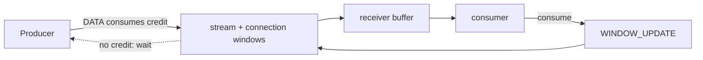

# HTTP/2 Flow Control, gRPC Backpressure & Buffer Bloat

## Konu anlatımı
Backpressure hızlı producer ile yavaş consumer arasındaki hız farkını sınırsız buffer yerine feedback ile taşır. HTTP/2 credit-based flow control kullanır: receiver hem stream hem connection düzeyinde kabul edebileceği DATA byte'larını window olarak bildirir. Sender DATA gönderdikçe credit düşer; receiver veriyi tüketince `WINDOW_UPDATE` ile credit iade eder. RFC 9113'e göre flow control hop-by-hop'tur ve DATA frame'lerine uygulanır.

gRPC streaming RPC'lerde alttaki transport flow control'ünden yararlanır. `write()` çağrısının dönmesi verinin karşı tarafa ulaştığını garanti etmez; framework buffer'ına kabul edilmiş olabilir. Slow consumer credit'i tükettiğinde sender sonunda bekler. Transport flow control, bounded application queue, concurrency limit, deadline ve load shedding'in alternatifi değildir.

## Mental model

## İçeride ne oluyor?
- Sender hem stream hem connection window'a uyar.
- HTTP/2 default initial window 65,535 byte'tır.
- Stream initial window SETTINGS ile, connection credit `WINDOW_UPDATE` ile değiştirilir.
- Window çok küçükse bandwidth-delay product doldurulamaz; çok büyükse memory ve queueing latency büyür.
- gRPC manual flow control yanlış kullanılırsa iki tarafın da write edip read etmemesi ilerlemeyi durdurabilir.
- Proxy zincirlerinde her hop bağımsız credit yönetir; backpressure dolaylı olarak upstream'e yayılabilir.

## Mülakat soruları
1. Backpressure ile rate limiting arasındaki fark nedir?
2. Neden stream ve connection olmak üzere iki window vardır?
3. `WINDOW_UPDATE` end-to-end mu, hop-by-hop mu?
4. gRPC `write()` tamamlanınca ne garanti edilir/ne edilmez?
5. Büyük window'un memory ve p99 etkisi nedir?
6. Staff: proxy → gRPC → DB zincirinde overload control'ü nasıl katmanlarsın?

## Seviye beklentisi
**Junior:** producer/consumer hız uyumsuzluğu. **Mid:** credit ve WINDOW_UPDATE. **Senior:** BDP, bounded memory, deadlines ve slow consumer. **Staff:** transport flow control + admission control + load shedding + downstream saturation tasarımı.

## Mini alıştırma
1 MiB connection, 256 KiB A ve 512 KiB B window'unda A 200 KiB, B 400 KiB gönderirse kalan credit'leri hesapla. A 128 KiB tükettiğinde stream ve connection credit'inin neden ayrı iade edildiğini açıkla.

## Proje fikri
Bidirectional gRPC streaming servisinde fast producer/slow consumer üret. Queue bound, message size ve delay'i değiştir; RSS, blocked-write time, throughput ve p99 ölç.

## Failure modes / trade-off / production
Unbounded application queue OOM'a; küçük window düşük throughput'a; büyük window memory ve tail latency'ye yol açabilir. Read yapmadan karşılıklı synchronous write progress'i durdurabilir. Active streams, queue bytes, blocked-write time, message age, connection memory, cancellations/deadlines ve downstream saturation izlenmelidir.

## Kaynaklar
- RFC 9113 — HTTP/2: https://www.rfc-editor.org/rfc/rfc9113.html
- gRPC — Flow Control: https://grpc.io/docs/guides/flow-control/
